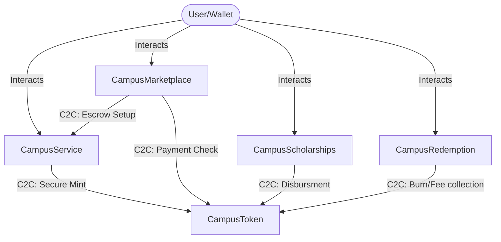

# CampusChain — Gap Analysis & Audit Report

This report presents a thorough audit of the existing Soroban smart contracts and Next.js frontend code against the UX/UI designs within the Google Stitch project (`10213228004952921230`). It outlines the functional, architectural, and security gaps, and details the steps required to transition the project to a production-ready state.

---

## 1. Stitch Screens Inventory

The following table lists the screens defined in the Stitch design workspace, their core visual components, and the corresponding data and actions required from the backend (smart contracts and Horizon API).

| Screen Name | Device Type | Key Components | Data / Actions Required from Backend |
| :--- | :--- | :--- | :--- |
| **CampusChain University Login** | Desktop & Mobile | Centralized login container, "Connect Wallet" button with Freighter icon. | • Connect wallet (fetch user Stellar public key)<br>• Fetch role via `get_role` from `CampusToken` contract<br>• Fetch membership status via `get_membership` from `CampusService` contract |
| **CampusChain Student Wallet Dashboard** / **Mobile Wallet** | Desktop & Mobile | • Sidebar navigation menu (Desktop) or bottom tab bar (Mobile)<br>• Total Balance Card (showing XLM and CAMP balance)<br>• Quick actions grid (Scan & Pay, Send, Buy CAMP, Marketplace)<br>• Monthly metrics cards (Total Spent, CAMP Earned, Events Attended)<br>• Recent Transactions ledger with icons and transaction detail rows | • Fetch XLM balance via Horizon API<br>• Fetch CAMP balance via `balance(address)` on `CampusToken`<br>• Fetch transaction logs (Horizon API for native payment ops; Soroban RPC `getEvents` for CAMP and service actions) |
| **CampusChain - Send & Receive** | Desktop & Mobile | • Tabs: "Send" / "Receive"<br>• Form: Recipient address, Amount input, Asset dropdown (XLM/CAMP), Memo<br>• Receive view: User Stellar address QR Code, copy public key button | • Verify recipient account exists on-chain<br>• Submit payment: standard `Operation.payment` via Horizon (for XLM) or `transfer` call via Soroban RPC (for CAMP) |
| **CampusChain - QR Scan & Pay** | Desktop & Mobile | • Camera viewfinder scanner interface<br>• Confirm transaction drawer overlay with pre-filled Recipient and Amount | • Parse QR data payload (Stellar URI / JSON)<br>• Submit transaction envelope to the ledger (Horizon/Soroban RPC) |
| **CampusChain - Student Marketplace** | Desktop & Mobile | • Search bar, Category filters, and Sort dropdowns<br>• Scrollable category chips (Books, Electronics, Notes, etc.)<br>• Grid of item cards (Title, Seller, Price in CAMP/XLM, Escrow badge) | • Query active marketplace listings (requires **NEW** listing registry)<br>• Filter/sort listings on-chain or via custom indexer |
| **CampusChain - Sell Item** | Desktop & Mobile | Form inputs: Title, Description, Price (CAMP), Category, Image upload dropzone, Escrow toggle, "List Item" button. | • Verify user has `Student` (1) or `Merchant` (2) role<br>• Create listing entry (requires **NEW** marketplace listing function) |
| **CampusChain - Item Detail** | Desktop & Mobile | • Image carousel, Title, Description, Category tag<br>• Seller Card (Avatar, Name, Role, Rating)<br>• Price block (CAMP + XLM conversion)<br>• Escrow Protection guarantee badge, "Buy Now" button | • Fetch specific listing details by ID (requires **NEW** contract)<br>• Initiate purchase: If Escrow is checked, call `create_escrow` on `CampusService`. If direct, call `transfer` on `CampusToken` |
| **CampusChain - Campus Events** | Desktop & Mobile | • Tabs: "Upcoming Events" / "My Hosted Events"<br>• Search bar, grid of event cards (Title, Host, price in CAMP, capacity, "Buy Ticket" button) | • Fetch events counter and active event details via `get_event` on `CampusService`<br>• Purchase ticket: invoke `buy_ticket` (preceded by token `approve`) |
| **CampusChain - My Tickets** | Desktop & Mobile | • Scrollable list of active and past tickets<br>• Ticket detail modal with Event details, check-in status, and QR Code (containing signed ticket ID/validation hash) | • Scan/poll contract events or scan ticket counter to retrieve tickets owned by user (currently no user-to-ticket index on-chain)<br>• Host-only scan check-in: invoke `redeem_ticket` on `CampusService` |
| **CampusChain - Scholarships** | Desktop & Mobile | • Active application card with state stepper (`Applied` -> `Under Review` -> `Approved` -> `Disbursed`)<br>• Available programs grid (GPA requirements, deadlines, CAMP reward, Apply button)<br>• Disbursement History table | • Fetch scholarship catalog & applications (requires **NEW** contract)<br>• Submit application: upload student profile, GPA, and recommendation (requires **NEW** contract)<br>• Admin disburses: mint/transfer pool to student (requires **NEW** contract) |
| **CampusChain - Rewards & CAMP** | Desktop & Mobile | • Balance container (CAMP balance & XLM conversion)<br>• Toggleable convert panel (From XLM to CAMP input, Confirm Swap)<br>• Recent Earnings list (Hackathon, Attendance, Mentorship)<br>• Utility rewards redemption grid (Dining discount, Bookstore voucher, Gym pass, with "Redeem" button) | • Convert XLM: invoke `buy_camp_tokens` on `CampusService`<br>• Redeem: burn/transfer CAMP and issue voucher details (requires **NEW** redemption contract) |
| **CampusChain - Merchant Dashboard** | Desktop & Mobile | • Sales metrics grid (Total Revenue, Active Escrows, Completed Escrows)<br>• Pending Escrows table (Buyer, Amount, Refund/Release actions)<br>• Active listings manager table (List items, edit/delete actions) | • Fetch escrows where merchant is `seller` (via event/storage indexing)<br>• Execute refund: invoke `refund_escrow` on `CampusService` (Seller auth)<br>• Edit/delete listings (requires **NEW** marketplace contract) |
| **CampusChain - Transaction History** | Desktop & Mobile | Detailed audit ledger table displaying date, transaction type, amount in CAMP or XLM, status, and transaction link. | Query transaction logs from Horizon and decode contract events from Soroban RPC `getEvents`. |
| **CampusChain - University Admin Dashboard** | Desktop & Mobile | • Global stats (Total wallets, XLM volume, CAMP circulating)<br>• Onboarding table (Merchant registration requests with Approve buttons)<br>• Volume chart<br>• "Issue CAMP" button | • Fetch circulating supply via `total_supply` from `CampusToken`<br>• Fetch onboarding requests via `list_pending_role_requests` from `CampusToken`<br>• Onboard: invoke `approve_role_change` or `deny_role_change` on `CampusToken`<br>• Issue rewards/grants: invoke `mint` on `CampusToken` |
| **CampusChain - Settings** | Desktop & Mobile | Network configurations (Testnet, Mainnet, Local node), custom RPC/Horizon server endpoints, Freighter wallet connection indicators. | Save configuration to Zustand store and reinitialize contract clients. |

---

## 2. Existing Contract Capabilities

The workspace contains two Soroban smart contracts under the `contracts/` directory: [CampusToken](file:///home/sandipansingh/Projects/CampusChain/contracts/campus-token/src/lib.rs) (the ERC20-equivalent token contract with roles) and [CampusService](file:///home/sandipansingh/Projects/CampusChain/contracts/campus-service/src/lib.rs) (managing escrows, events, university registries, and basic faucet/purchases).

| Contract Name | Public Functions | Storage Keys Used & Storage Types | Access Control Present | Events Emitted |
| :--- | :--- | :--- | :---: | :---: |
| **CampusToken** | `initialize`, `admin`, `name`, `symbol`, `decimals`, `total_supply`, `balance`, `transfer`, `approve`, `allowance`, `transfer_from`, `mint`, `mint_purchase`, `burn`, `set_role`, `request_role_change`, `approve_role_change`, `deny_role_change`, `get_role_request`, `list_pending_role_requests`, `get_role`, `has_claimed_faucet`, `faucet`, `upgrade` | **Instance**: `Admin`, `TotalSupply`, `TokenName`, `TokenSymbol`, `TokenDecimals`, `RoleRequestCounter`<br>**Persistent**: `Balance(Address)`, `Allowance(Address, Address)`, `Role(Address)`, `FaucetClaimed(Address)`, `RoleRequest(u64)` | **Yes**<br>• Admin auth: `mint`, `set_role` (for roles >= 2), `approve_role_change`, `deny_role_change`, `upgrade`<br>• Caller auth: `transfer`, `approve`, `transfer_from`, `burn`, `request_role_change`, `faucet` | **Yes**<br>`initialize`, `transfer`, `approve`, `mint`, `mint_purchase`, `burn`, `role_updated`, `role_change_requested`, `role_change_approved`, `role_change_denied`, `faucet` |
| **CampusService** | `initialize`, `admin`, `token_contract`, `create_escrow`, `get_escrow`, `release_escrow`, `refund_escrow`, `create_event`, `get_event`, `buy_ticket`, `get_ticket`, `redeem_ticket`, `register_university`, `get_university`, `list_universities`, `request_join`, `approve_member`, `deny_member`, `get_join_request`, `invite_member`, `accept_invite`, `leave_university`, `list_pending_requests`, `get_membership`, `has_claimed_faucet`, `claim_faucet`, `buy_camp_tokens`, `upgrade` | **Instance**: `Admin`, `TokenContract`, `EscrowCounter`, `EventCounter`, `TicketCounter`, `UniversityCounter`, `JoinRequestCounter`, `InviteCounter`<br>**Persistent**: `Escrow(u64)`, `Event(u64)`, `Ticket(u64)`, `University(u64)`, `UniversityMember(Address)`, `JoinRequest(u64)`, `Invite(u64)` | **Yes**<br>• Admin/Upgrade: `upgrade`<br>• Escrow checks: release requires buyer/admin; refund requires seller/admin<br>• Events: host must be Club (3) or Admin (4)<br>• Ticket redemption: host must be the event host<br>• University: registers require Admin (4); approve/invite requires university admin | **Yes**<br>`escrow_created`, `escrow_released`, `escrow_refunded`, `event_created`, `ticket_bought`, `ticket_redeemed`, `university_registered`, `join_requested`, `member_approved`, `member_invited`, `invite_accepted`, `member_left`, `faucet_claimed`, `purchase_camp` |

---

## 3. Required vs. Implemented Matrix

This matrix maps user-facing features and screen actions against what currently exists in the codebase.

| User-Facing Action | Screen Origin | Status | Mapping to Existing Contract API / Gaps |
| :--- | :--- | :---: | :--- |
| **Connect Wallet** | Login | **[IMPLEMENTED]** | Handled on frontend via Freighter window provider (`window.sorobanUserApi`). |
| **Send/Receive XLM** | Send & Receive | **[IMPLEMENTED]** | Handled via Horizon API classic payments. |
| **Send/Receive CAMP** | Send & Receive | **[IMPLEMENTED]** | Invokes `transfer` on `CampusToken` contract. |
| **Claim Faucet (100 CAMP)** | Wallet/Rewards | **[IMPLEMENTED]** | Invokes `claim_faucet` on `CampusService` (which calls `faucet` on `CampusToken`). |
| **Register University** | Profile/Hub | **[IMPLEMENTED]** | Invokes `register_university` on `CampusService`. |
| **Request to Join / Leave** | Profile/Hub | **[IMPLEMENTED]** | Invokes `request_join` / `leave_university` on `CampusService`. |
| **Approve Member / Invite** | Profile/Hub | **[IMPLEMENTED]** | Invokes `approve_member` / `invite_member` / `accept_invite` on `CampusService`. |
| **Request Merchant/Club Role** | Profile / Admin | **[IMPLEMENTED]** | Invokes `request_role_change` on `CampusToken` for admin review. |
| **Approve Onboarding** | Admin Dashboard | **[IMPLEMENTED]** | Invokes `approve_role_change` on `CampusToken`. |
| **Create Escrow** | Dashboard / Checkout | **[IMPLEMENTED]** | Invokes `create_escrow` on `CampusService` (locks buyer's pre-approved CAMP tokens). |
| **Release Escrow** | Wallet / Dashboard | **[IMPLEMENTED]** | Invokes `release_escrow` on `CampusService` (buyer only). |
| **Refund Escrow** | Wallet / Dashboard | **[IMPLEMENTED]** | Invokes `refund_escrow` on `CampusService` (seller only). |
| **Host Event** | Events Dashboard | **[IMPLEMENTED]** | Invokes `create_event` on `CampusService` (restricts to Club/Admin roles). |
| **Buy Event Ticket** | Campus Events | **[IMPLEMENTED]** | Invokes `buy_ticket` on `CampusService` (pre-approved CAMP, transfers to host). |
| **Redeem Ticket (Check-in)** | My Tickets | **[IMPLEMENTED]** | Invokes `redeem_ticket` on `CampusService` (event host validates and redeems ticket). |
| **Buy CAMP with XLM** | Rewards / Wallet | **[PARTIAL]** | Invokes `buy_camp_tokens` on `CampusService` but has a **critical security vulnerability** where native payment is unverified on-chain. |
| **List Marketplace Item** | Sell Item | **[MISSING]** | No registry contract or database table exists to store/index listings. |
| **Buy Item with Escrow** | Item Detail | **[PARTIAL]** | Escrow contract functions exist, but the marketplace listing state transition and mapping to listings are missing. |
| **Issue CAMP Reward** | Admin Dashboard | **[MISSING]** | Admins can `mint` CAMP, but there is no dedicated reward/grant registry to log achievements (e.g. Hackathon winner). |
| **Apply for Scholarship** | Scholarships | **[MISSING]** | No scholarship program database, application registry, or review logic exists on-chain. |
| **Disburse Scholarship** | Scholarships | **[MISSING]** | No scholarship fund lock-ups or multi-sig disbursement flows are implemented. |
| **Redeem CAMP for Utilities** | Rewards | **[MISSING]** | No utility rewards catalog or redemption logging/vouchering exists on-chain. |

---

## 4. Required New & Updated Contracts

To achieve a production-ready system matching the Stitch mockups, two existing contracts must be refactored to resolve vulnerabilities, and three new contracts must be created.



### A. Critical Security & Logical Updates to Existing Contracts

#### 1. `CampusToken` (Modify)
* **Vulnerability — Unprotected `mint_purchase`**:
  `mint_purchase` (L361) is a public function that mints CAMP tokens to any recipient. It contains no caller restriction, meaning any account can call it directly to mint unlimited CAMP tokens for free.
* **Remediation**:
  We must store the `CampusService` contract ID in `CampusToken` (either during initialization or via an admin setter) and enforce that `mint_purchase` can only be invoked by `CampusService`:
  ```rust
  let caller = env.caller(); // Returns Address of calling contract
  assert_eq!(caller, registered_service_contract);
  ```

#### 2. `CampusService` (Modify)
* **Vulnerability — Insecure Token Purchase**:
  `buy_camp_tokens` (L922) takes an `xlm_amount` argument and directly mints the corresponding CAMP. Since Soroban cannot naturally read the classic Stellar Horizon ledger history, the contract cannot verify if the user actually paid the XLM to the administrator address. Any user can call this with a fake `xlm_amount` to mint tokens.
* **Remediation — Native XLM SAC Integration**:
  The contract should verify the XLM payment natively on-chain. We can import the native Stellar Asset Contract (SAC) for XLM (using the testnet/mainnet native contract ID) and call its `transfer_from` function. The transaction will pull native XLM from the user's wallet directly into the contract (or a dedicated admin vault address) *within the same transaction atomicity*. If the XLM transfer succeeds, the contract then proceeds to call `CampusToken::mint_purchase`:
  ```rust
  let native_xlm_client = token::Client::new(&env, &native_xlm_contract_address);
  native_xlm_client.transfer_from(&env.current_contract_address(), &recipient, &admin_vault, &xlm_amount);
  // Proceed to mint CAMP if transfer succeeds
  ```

---

### B. New Contracts Required

#### 1. `CampusMarketplace` (New Contract)
Handles listings, sorting, and purchase mechanics.
* **Custom Storage Design**:
  - `DataKey::ListingCounter` (Instance, `u64`): Track total listings.
  - `DataKey::Listing(u64)` (Persistent, `ListingDetails`): Store specific listing metadata.
  - Listing structs must be stored in persistent storage and extended via `extend_ttl` during reads and writes to prevent eviction.
* **Access Control & Ownership**:
  - Listing creation is restricted to registered `Student` (1) and `Merchant` (2) roles.
  - Only the listing owner (the seller) can call `cancel_listing` or `update_listing`.
* **State Transition Logic**:
  `Active (1)` -> `Sold (2)` (via purchase) or `Cancelled (3)` (via seller cancel).
* **Inter-contract Calls**:
  Calls `CampusService::create_escrow` (if escrow toggle is enabled) or `CampusToken::transfer` (for direct payment) on behalf of the buyer.
* **Events to Emit**:
  `item_listed(id, seller, price)`, `item_sold(id, buyer)`, `item_cancelled(id)`.

#### 2. `CampusScholarships` (New Contract)
Manages scholarship programs, student applications, and disbursements.
* **Custom Storage Design**:
  - `DataKey::ProgramCounter` (Instance, `u64`): ID tracker for scholarship programs.
  - `DataKey::Program(u64)` (Persistent, `ScholarshipProgram`): Details of the scholarship (sponsor, reward amount, GPA eligibility, status).
  - `DataKey::Application(u64)` (Persistent, `ApplicationDetails`): Tracks application records (student address, GPA, status).
* **Access Control & RBAC**:
  - Only `University Admin` (4) can create programs, change application status, or trigger disbursement.
  - Only `Student` (1) users can call `apply_for_scholarship`.
* **State Transition Logic**:
  Application transitions: `Applied (0)` -> `Under Review (1)` -> `Approved (2)` or `Rejected (3)` -> `Disbursed (4)`.
* **Inter-contract Calls**:
  Calls `CampusToken::transfer` to disburse locked reward funds from the scholarship program's wallet to the student.
* **Events to Emit**:
  `scholarship_program_created`, `scholarship_applied`, `scholarship_approved`, `scholarship_disbursed`.

#### 3. `CampusRedemption` (New Contract)
Operates the rewards catalog, accepting CAMP and delivering offline/online vouchers.
* **Custom Storage Design**:
  - `DataKey::CatalogItem(u64)` (Persistent, `CatalogItem`): Vouchers available (Cafeteria, Bookstore, Gym) and CAMP price.
  - `DataKey::RedemptionCounter` (Instance, `u64`).
  - `DataKey::RedemptionRecord(u64)` (Persistent, `RedemptionRecord`): Mapping of student to redeemed voucher code.
* **State Transition Logic**:
  `Redeemed (1)` (student locks CAMP, gets voucher) -> `Fulfilled (2)` (merchant scans voucher and redeems).
* **Inter-contract Calls**:
  Calls `CampusToken::transfer_from` to pull CAMP from the student's wallet and either transfers it to the merchant/treasury or calls `CampusToken::burn` to reduce circulating supply.
* **Events to Emit**:
  `reward_redeemed(redemption_id, student, item_id)`, `redemption_fulfilled(redemption_id, merchant)`.

---

## 5. Frontend Architecture Gap

While basic Soroban hooks exist under `frontend/src/hooks/`, several architectural gaps prevent support for the Stitch UX/UI layouts:

1. **StellarWalletsKit Integration**:
   The current frontend directly uses the window Freighter provider (`window.sorobanUserApi`). For production, we must integrate `@stellar/stellar-wallets-kit` to provide a unified modal allowing students to connect via Freighter, Rabe, Albedo, or Ledger.
2. **Transaction Lifecycle UI**:
   The UI lacks feedback for block confirmation. We need a global transaction toast/notification manager integrated with the `useTransactionStore` Zustand store. When a transaction is submitted, a floating spinner must track its status (`pending` -> `polling` -> `confirmed` or `failed`), with direct links to StellarExpert testnet explorer.
3. **Real-time Event Subscription**:
   The current hooks poll the Soroban RPC every 10-15 seconds. For a smoother experience, we should optimize polling depths (applying a strict ledger limit to prevent RPC timeouts) and implement event deduplication.
4. **Domain-Driven Feature Folder Structure**:
   The current layout is flat. It should be restructured by domain features:
   ```
   src/
     features/
       wallet/        <-- Faucet, Buy CAMP, Transfer
       marketplace/   <-- Listings grid, Sell form, Detail card, Escrows
       events/        <-- Host event, ticket purchase, check-in QR scanner
       scholarships/  <-- Stepper, GPA application form, history
       rewards/       <-- Catalog, conversion panel, voucher cards
   ```
5. **Additional Zustand Stores**:
   - `useMarketplaceStore`: Track listing query states, category filters, and active merchant sales.
   - `useScholarshipStore`: Track scholarship catalog, application history, and the state of active stepper records.
   - `useRewardsStore`: Store catalog rewards list and active unredeemed vouchers.
6. **Feature API / Service Layer**:
   Components currently compile raw XDR envelopes. We must extract these into clean service classes under `src/services/` (e.g., `marketplace.ts`, `scholarships.ts`, `rewards.ts`). These services should handle transaction simulation, resource fee estimation (`prepareTransaction`), and client invokes.

---

## 6. Proposed Build Order

A dependency-ordered phase plan to implement the audited requirements:

```
[Phase 1: Security & Core Upgrades]
  ├── Secure CampusToken.mint_purchase (C2C constraint)
  └── Implement secure Native XLM SAC in CampusService.buy_camp_tokens
         │
         ▼
[Phase 2: New Contracts Development]
  ├── Build CampusMarketplace contract (Listing states & Escrow hooks)
  ├── Build CampusScholarships contract (Application database & Stepper state)
  └── Build CampusRedemption contract (Utility catalogs & CAMP burn)
         │
         ▼
[Phase 3: Deploy & Testnet Integrations]
  ├── Compile & Optimize WASM
  ├── Deploy to Stellar Testnet (via updated scripts/deploy.sh)
  └── Export Contract IDs & TypeScript Types
         │
         ▼
[Phase 4: Frontend Directory Restructure & Setup]
  ├── Restructure into features/ domain-driven layouts
  ├── Integrate StellarWalletsKit
  └── Implement Zustand Stores (Marketplace, Scholarships, Rewards)
         │
         ▼
[Phase 5: Page-by-Page Integration & Testing]
  ├── Hook up Marketplace listing & Sell Item pages
  ├── Hook up Rewards conversion & Voucher Redemptions
  └── Hook up Scholarships GPA applications & stepper tracking
```

---

*This concludes the Gap Analysis audit. Smart contract modifications and frontend integrations should follow the proposed Build Order during Phase 3 implementation.*
