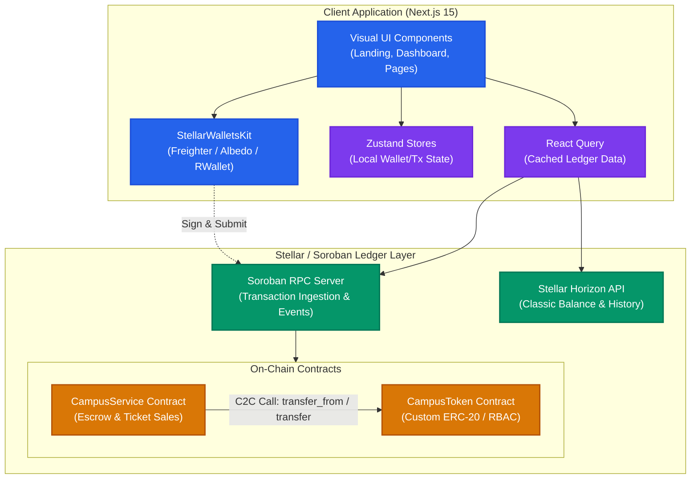

# CampusChain – A Unified Campus Economy Powered by Stellar

CampusChain is a unified campus economy platform that replaces disconnected cash- and manual-verification-based campus payment systems with a single secure, Stellar-powered payment and escrow portal.

CampusChain enables instant merchant payments, peer-to-peer transfers, rewards token distribution, marketplace purchases via smart contract-managed escrow, and digital ticketing.

---

## 1. System Architecture

The following diagram illustrates the interaction between the Next.js frontend app, the state layer (Zustand, React Query), and the Stellar/Soroban ledger layer.



---

## 2. Tech Stack

- **Smart Contracts**: Rust & Soroban SDK
- **Frontend**: Next.js 15, TypeScript, Tailwind CSS, shadcn/ui
- **State Management**: Zustand & TanStack React Query v5
- **Wallet Integrations**: StellarWalletsKit
- **Testing**: Vitest & React Testing Library (Frontend), Rust native test harness (Contracts)
- **CI/CD**: GitHub Actions

---

## 3. Quick Start

### Contract Workspace
To compile and test the contracts, run:
```bash
cargo build --target wasm32-unknown-unknown --release
cargo test
```

### Frontend Workspace
To launch the dev server:
```bash
cd frontend
npm install
npm run dev
```

---

## 4. Documentation Index

Detailed engineering guides are located in the `/docs` directory:
- [System Architecture & Diagrams](file:///home/sandipansingh/Projects/CampusChain/docs/architecture.md)
- [Smart Contract Specifications](file:///home/sandipansingh/Projects/CampusChain/docs/CONTRACTS.md)
- [Security Practices & Threat Modeling](file:///home/sandipansingh/Projects/CampusChain/docs/SECURITY.md)
- [Deployment & Upgrade Guide](file:///home/sandipansingh/Projects/CampusChain/docs/DEPLOYMENT.md)
- [Frontend API & Hooks Schema](file:///home/sandipansingh/Projects/CampusChain/docs/API.md)

---

## 5. Contract Deployments

| Contract | Network | Address | Explorer Link |
|---|---|---|---|
| `CampusToken` | Testnet | *Pending Deployment* | [StellarExpert](https://stellar.expert/explorer/testnet/contract/*Pending*) |
| `CampusService` | Testnet | *Pending Deployment* | [StellarExpert](https://stellar.expert/explorer/testnet/contract/*Pending*) |
