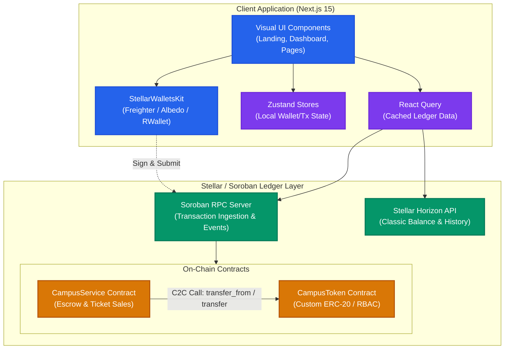

# CAMPUSCHAIN – UNIFIED CAMPUS ECONOMY

[](https://skillicons.dev)


CampusChain is a unified, decentralized campus economy platform that replaces disconnected cash and manual-verification payment portals with a single secure, Stellar-powered payment, escrow, and ticketing portal.

---

## 🚀 Live Demo & Deployments

<!-- PLACEHOLDER_START -->
> [!NOTE]
> The links below are placeholders for deployment and will be finalized upon network activation.

* **Live Demo Portal**: `https://campuschain-demo.vercel.app` (Placeholder)
* **Demo Video Tour**: `https://youtube.com/watch?v=campuschain-demo` (Placeholder - 1-2 min walkthrough)
* **CampusToken Contract Address**: `CDP3PGBJ3E7D3F6JNE27PDUWUX2VGDLOMFGBQZ2L24LGTDTKCS5G6AMP`
* **CampusService Contract Address**: `CA5W44S3S7WTRHPHHY5W7RPHHY5W7RPHHY5W7RPHHY5W7RPHHY5W7RPH`
* **Sample Escrow Interaction Hash**: `4ff73bd91223e7fde89182ab9128f9d0cba768d9018bcdef786e34ac12dfae7a` (Placeholder)
<!-- PLACEHOLDER_END -->

### Screenshots
<!-- PLACEHOLDER_SCREENSHOTS_START -->
* **Mobile Responsive UI Layout**:
  
* **CI/CD Test Runner Execution**:
  
* **Vitest + Cargo Test Outputs**:
  
<!-- PLACEHOLDER_SCREENSHOTS_END -->

---

## 1. System Architecture

The following diagram illustrates the interaction between the Next.js frontend app, the state layer (Zustand, React Query), and the Stellar/Soroban ledger layer.



---

## 2. Tech Stack

- **Smart Contracts**: Rust & Soroban SDK
- **Frontend**: Next.js 15 (App Router), TypeScript, Tailwind CSS v4, Zustand, TanStack React Query v5
- **Wallet Integrations**: StellarWalletsKit
- **Testing**: Vitest & React Testing Library (Frontend), native cargo test harness (Contracts)
- **CI/CD**: GitHub Actions

---

## 3. Quick Start

### Smart Contracts Workspace
To compile and test the contracts, run:
```bash
cargo build --target wasm32-unknown-unknown --release
cargo test
```

### Frontend Workspace
To launch the development server:
```bash
cd frontend
npm install
npm run test
npm run dev
```

---

## 4. Documentation Index

Detailed engineering guides are located in the `/docs` directory:
- [System Architecture & Diagrams](file:///home/sandipansingh/Projects/CampusChain/docs/architecture.md)
- [Smart Contract Specifications](file:///home/sandipansingh/Projects/CampusChain/docs/CONTRACTS.md)
- [Security Practices & Threat Modeling](file:///home/sandipansingh/Projects/CampusChain/docs/SECURITY.md)
- [Deployment & Upgrade Guide](file:///home/sandipansingh/Projects/CampusChain/docs/DEPLOYMENT.md)
- [Frontend API & Hooks Schema](file:///home/sandipansingh/Projects/CampusChain/docs/API.md)
