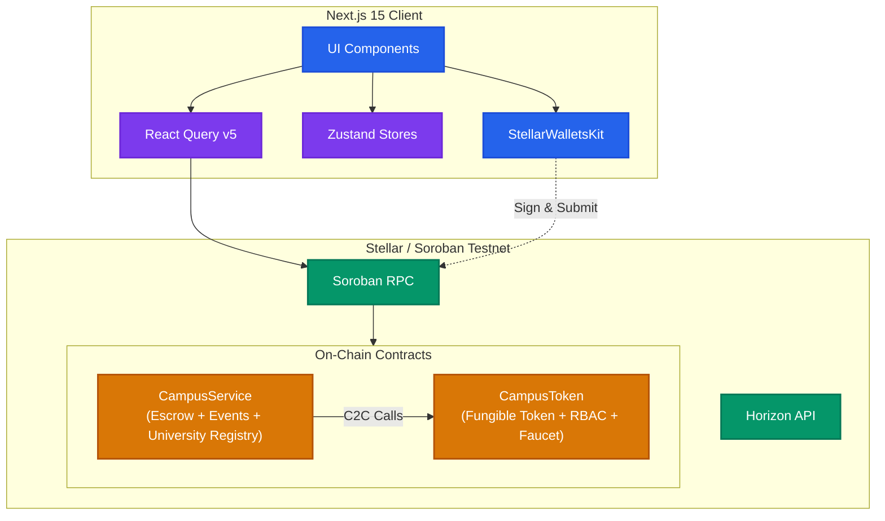
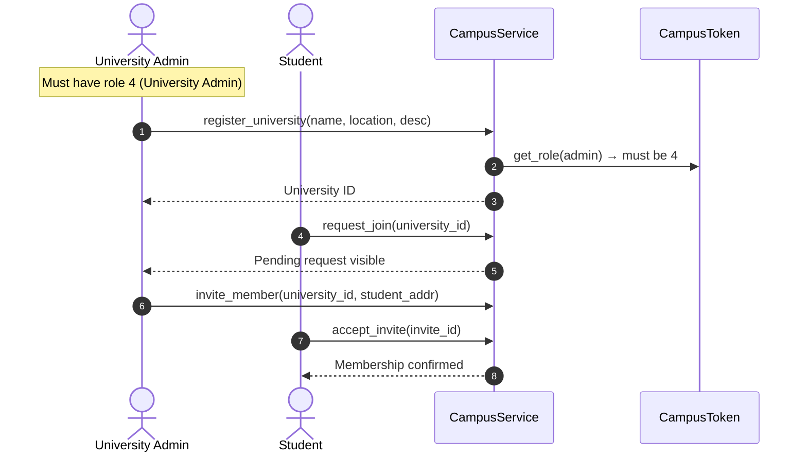
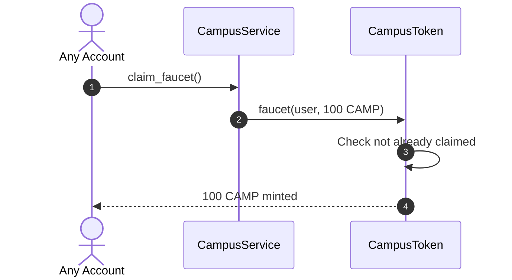
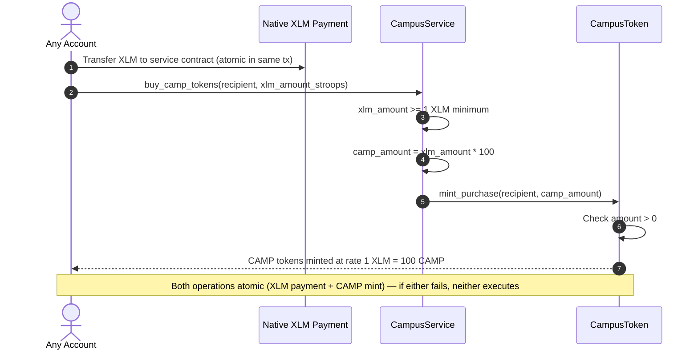

# <p align="center">CAMPUSCHAIN – UNIFIED CAMPUS ECONOMY</p>

CampusChain is a unified, decentralized campus economy platform that replaces disconnected cash and manual-verification payment portals with a single secure, Stellar-powered payment, escrow, ticketing, and university registry portal.

---

## 🚀 Live Deployments (Soroban Testnet)

| Contract | Address |
|---|---|
| **CampusToken** | `CDJQUJ7TK2X3FDQNYKM3MVV57A35FTP2UVRFNSVUABBBTAS6AMMWUZ4R` |
| **CampusService** | `CCPBJGPUZJJ3OILAZBORJR3HTXUXJOT4LOO2EERTTP5FFM6SMQ6JO7JM` |

### Recent Transactions

| Action | Tx Hash |
|---|---|
| CampusToken upload | [af19f8f7a7e835b88762521f269f477b9791cf4ae91f99c1175e73f1e2516e85](https://stellar.expert/explorer/testnet/tx/af19f8f7a7e835b88762521f269f477b9791cf4ae91f99c1175e73f1e2516e85) |
| CampusToken deploy | [1ba8a6e7a20273fbd74fc2dd513676500fe4db95537e48e104d2c61cb0bd38cc](https://stellar.expert/explorer/testnet/tx/1ba8a6e7a20273fbd74fc2dd513676500fe4db95537e48e104d2c61cb0bd38cc) |
| CampusToken init | [9c14f2c8238d36c19ec0b0814cb7293f55b7174188c8d26fed24f0318b938a6d](https://stellar.expert/explorer/testnet/tx/9c14f2c8238d36c19ec0b0814cb7293f55b7174188c8d26fed24f0318b938a6d) |
| CampusService upload | [c84a106aefa74160df336f9baf5ddd1b9c6e574eccd4f737fea24e65eb45b802](https://stellar.expert/explorer/testnet/tx/c84a106aefa74160df336f9baf5ddd1b9c6e574eccd4f737fea24e65eb45b802) |
| CampusService deploy | [a10826fb1d6c03d519e3ee34e4551fd9ca2673265b0b14fecd57c07e4dd42aa6](https://stellar.expert/explorer/testnet/tx/a10826fb1d6c03d519e3ee34e4551fd9ca2673265b0b14fecd57c07e4dd42aa6) |
| CampusService init | [3ad758bf065793f18aa383bfd74b7ba7d0473f2973831f0bd2622bcc56cb6a08](https://stellar.expert/explorer/testnet/tx/3ad758bf065793f18aa383bfd74b7ba7d0473f2973831f0bd2622bcc56cb6a08) |

---

## 1. System Architecture

### Component Architecture


### Key Flows

**University Registration & Membership**


**Token Faucet**


**Buy CAMP with XLM**


---

## 2. Smart Contracts

### CampusToken (`contracts/campus-token`)
- **Fungible token** (7 decimals, symbol: CAMP)
- **RBAC**: `set_role(admin, address, role)` — role 0-1 self-assignable, role 2+ requires contract admin approval
- **Role Request Flow**: `request_role_change(applicant, role)`, `approve_role_change(request_id, admin)`, `deny_role_change(request_id, admin)` — Merchant (2) and Club Organizer (3) require admin approval
- **Faucet**: `faucet(address, amount)` — one-time claim of 100 CAMP per address
- **Purchase Mint**: `mint_purchase(address, amount)` — called by CampusService to mint CAMP when users buy with XLM
- **Standard token ops**: `transfer`, `approve`, `transfer_from`, `mint`, `burn`, `balance`

### CampusService (`contracts/campus-service`)
- **University Registry**: `register_university`, `list_universities`, `get_university`
- **Membership**: `request_join`, `approve_member`, `deny_member`, `invite_member`, `accept_invite`, `leave_university`, `get_membership`, `list_pending_requests`
- **Escrow**: `create_escrow`, `get_escrow`, `release_escrow`, `refund_escrow`
- **Event Ticketing**: `create_event`, `get_event`, `buy_ticket`, `get_ticket`, `redeem_ticket`
- **Token Claim**: `claim_faucet`, `has_claimed_faucet`
- **Buy CAMP**: `buy_camp_tokens(recipient, xlm_amount)` — purchase rate 1 XLM = 100 CAMP (minimum 1 XLM), XLM transferred atomically via native payment op in same tx
- **Frontend fix**: All contract call parameters now use correct `u64` ScVal type (previously incorrectly sent as `u32`, causing join/invite failures)

---

## 3. Tech Stack

[](https://skillicons.dev)


- **Smart Contracts**: Rust & Soroban SDK v21
- **Frontend**: Next.js 15 (App Router), TypeScript, Tailwind CSS v4, Zustand, TanStack React Query v5
- **Wallet**: StellarWalletsKit (Freighter)
- **Testing**: `cargo test` (11 contract tests: 7 token + 4 service), Vitest (frontend)
- **CI/CD**: GitHub Actions

---

## 4. Quick Start

### Smart Contracts
```bash
cargo build --target wasm32-unknown-unknown --release
cargo test
```

### Frontend
```bash
cd frontend
npm install
npm run dev
```

### Deploy (Testnet)
```bash
CAMPUSCHAIN_ADMIN_KEY=<secret_key> ./scripts/deploy.sh
```

### Frontend Env
Copy `frontend/.env.local` with:
```
NEXT_PUBLIC_STELLAR_RPC_URL="https://soroban-testnet.stellar.org"
NEXT_PUBLIC_STELLAR_PASSPHRASE="Test SDF Network ; September 2015"
NEXT_PUBLIC_CAMPUS_TOKEN_CONTRACT_ID="CDJQUJ7TK2X3FDQNYKM3MVV57A35FTP2UVRFNSVUABBBTAS6AMMWUZ4R"
NEXT_PUBLIC_CAMPUS_SERVICE_CONTRACT_ID="CCPBJGPUZJJ3OILAZBORJR3HTXUXJOT4LOO2EERTTP5FFM6SMQ6JO7JM"
NEXT_PUBLIC_CAMPUS_ADMIN_ADDRESS="GAGFUM56FNDCCNCQCCDBLBFLXAUKIM233I7IQP5UF2PI2M6PKXT2C2WM"
```

---

## 5. Documentation Index

- [System Architecture & Diagrams](./docs/architecture.md)
- [Smart Contract Specifications](./docs/CONTRACTS.md)
- [Security Practices & Threat Modeling](./docs/SECURITY.md)
- [Deployment & Upgrade Guide](./docs/DEPLOYMENT.md)
- [Frontend API & Hooks Schema](./docs/API.md)
