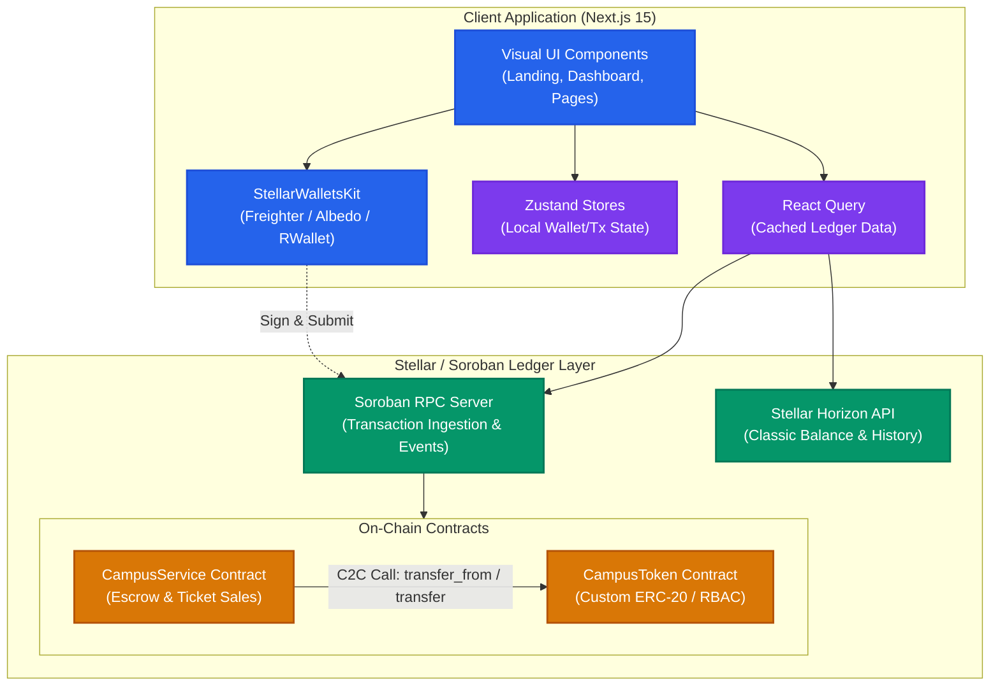
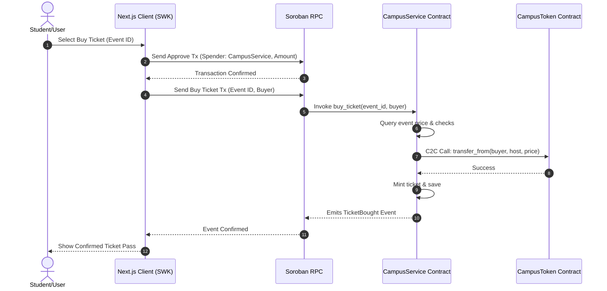

# <p align="center">CAMPUSCHAIN – UNIFIED CAMPUS ECONOMY</p>

CampusChain is a unified, decentralized campus economy platform that replaces disconnected cash and manual-verification payment portals with a single secure, Stellar-powered payment, escrow, and ticketing portal.

---

## 🚀 Live Demo & Deployments

> [!NOTE]
> The links below are placeholders for deployment and will be finalized upon network activation.

* **Live Demo Portal**: `https://campuschain-demo.vercel.app`
* **Demo Video Tour**: `https://youtube.com/watch?v=campuschain-demo`
* **CampusToken Contract Address**: `CBDN7REWPLUZX3CFPF4KUIIDSOJ4HN73VOQF7UPYFPKR6SH2USM6CWAN`
* **CampusService Contract Address**: `CBSWJFE4HPAROL2LMLEABBS25O6VMC4VVMKEZRUKPMYGQ75E5IIRB6M4`
* **CampusToken Deploy Tx Hash**: [0e3bb8bba5ce033e95ee6f9c5559d3cd37eb8a1da77a70865f4fe742c8602d90](https://stellar.expert/explorer/testnet/tx/0e3bb8bba5ce033e95ee6f9c5559d3cd37eb8a1da77a70865f4fe742c8602d90)
* **CampusService Init Tx Hash**: [30d914f78d4247a5498641bf7b41c35198edea05924662b59ab9e89e28a9b18d](https://stellar.expert/explorer/testnet/tx/30d914f78d4247a5498641bf7b41c35198edea05924662b59ab9e89e28a9b18d)

### Screenshots
* **Mobile Responsive UI Layout**:
  
* **CI/CD Test Runner Execution**:
  
* **Vitest + Cargo Test Outputs**:
  

---

## 1. System Architecture

The following diagrams illustrate the CampusChain platform architecture and transaction sequence. For complete details, see [System Architecture & Diagrams](./docs/architecture.md).

### Component Architecture


### Ticket Purchase Sequence (C2C Calls & Events)


---

## 2. Tech Stack

[](https://skillicons.dev)


- **Smart Contracts**: Rust & Soroban SDK
- **Frontend**: Next.js 15 (App Router), TypeScript, Tailwind CSS v4, Zustand, TanStack React Query v5
- **Wallet Integrations**: StellarWalletsKit
- **Testing**: Vitest & React Testing Library (Frontend), native cargo test harness (Contracts)
- **CI/CD**: GitHub Actions

---

## 3. Quick Start

### Smart Contracts Workspace
To compile and test the contracts, run:
```bash
cargo build --target wasm32-unknown-unknown --release
cargo test
```

### Frontend Workspace
To launch the development server:
```bash
cd frontend
npm install
npm run test
npm run dev
```

---

## 4. Documentation Index

Detailed engineering guides are located in the `/docs` directory:
- [System Architecture & Diagrams](./docs/architecture.md)
- [Smart Contract Specifications](./docs/CONTRACTS.md)
- [Security Practices & Threat Modeling](./docs/SECURITY.md)
- [Deployment & Upgrade Guide](./docs/DEPLOYMENT.md)
- [Frontend API & Hooks Schema](./docs/API.md)
