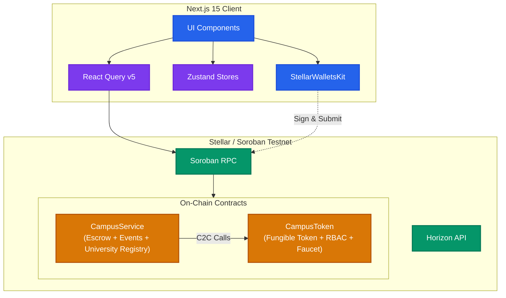
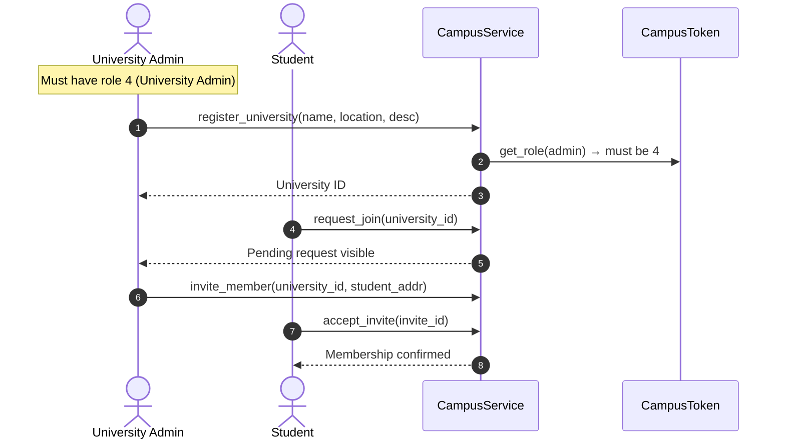
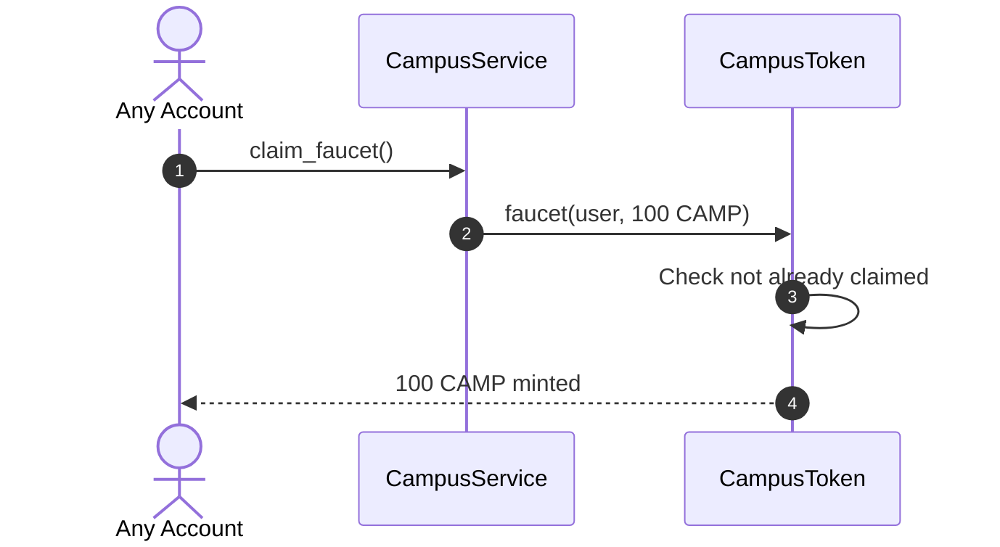

# <p align="center">CAMPUSCHAIN – UNIFIED CAMPUS ECONOMY</p>

CampusChain is a unified, decentralized campus economy platform that replaces disconnected cash and manual-verification payment portals with a single secure, Stellar-powered payment, escrow, ticketing, and university registry portal.

---

## 🚀 Live Deployments (Soroban Testnet)

| Contract | Address |
|---|---|
| **CampusToken** | `CA5OK6BWFRN67257RITZMLAY2YJ6T6FTU2ZM3UY76QYIE6DXB5QUAPMV` |
| **CampusService** | `CA5BDN2A2FM5AR3FEOBPPUCEAJCNKPKRRQFSLZ66SP7LGDKVJEKRPYTK` |

### Recent Transactions

| Action | Tx Hash |
|---|---|
| CampusToken deploy | [0bf506c9111fe357723c8464d395985981d4d043026959ced2a2ac543a29c335](https://stellar.expert/explorer/testnet/tx/0bf506c9111fe357723c8464d395985981d4d043026959ced2a2ac543a29c335) |
| CampusToken init | [0bebcbc914413d73964e7b29e78d79c8081557b14903b2605ee65a713b4fadb0](https://stellar.expert/explorer/testnet/tx/0bebcbc914413d73964e7b29e78d79c8081557b14903b2605ee65a713b4fadb0) |
| CampusService deploy | [e96b73c167de52d2d80e64f9d680e679729ab4726a663e2b93c99a377ec8cd5c](https://stellar.expert/explorer/testnet/tx/e96b73c167de52d2d80e64f9d680e679729ab4726a663e2b93c99a377ec8cd5c) |
| CampusService init | [32644dc1c49608e6299016024a025abc70c5cdaec7ff75e445a2a8b6e0910b75](https://stellar.expert/explorer/testnet/tx/32644dc1c49608e6299016024a025abc70c5cdaec7ff75e445a2a8b6e0910b75) |

---

## 1. System Architecture

### Component Architecture


### Key Flows

**University Registration & Membership**


**Token Faucet**


---

## 2. Smart Contracts

### CampusToken (`contracts/campus-token`)
- **Fungible token** (7 decimals, symbol: CAMP)
- **RBAC**: `set_role(address, role)` — self-registration (0=Guest, 1=Student, 2=Merchant, 3=Club Organizer, 4=University Admin)
- **Faucet**: `faucet(address, amount)` — one-time claim of 100 CAMP per address
- **Standard token ops**: `transfer`, `approve`, `transfer_from`, `mint`, `burn`, `balance`

### CampusService (`contracts/campus-service`)
- **University Registry**: `register_university`, `list_universities`, `get_university`
- **Membership**: `request_join`, `approve_member`, `deny_member`, `invite_member`, `accept_invite`, `leave_university`, `get_membership`, `list_pending_requests`
- **Escrow**: `create_escrow`, `get_escrow`, `release_escrow`, `refund_escrow`
- **Event Ticketing**: `create_event`, `get_event`, `buy_ticket`, `get_ticket`, `redeem_ticket`
- **Token Claim**: `claim_faucet` — delegates to `CampusToken.faucet`

---

## 3. Tech Stack

[](https://skillicons.dev)


- **Smart Contracts**: Rust & Soroban SDK v21
- **Frontend**: Next.js 15 (App Router), TypeScript, Tailwind CSS v4, Zustand, TanStack React Query v5
- **Wallet**: StellarWalletsKit (Freighter)
- **Testing**: `cargo test` (7 contract tests), Vitest (frontend)
- **CI/CD**: GitHub Actions

---

## 4. Quick Start

### Smart Contracts
```bash
cargo build --target wasm32-unknown-unknown --release
cargo test
```

### Frontend
```bash
cd frontend
npm install
npm run dev
```

### Deploy (Testnet)
```bash
CAMPUSCHAIN_ADMIN_KEY=<secret_key> ./scripts/deploy.sh
```

### Frontend Env
Copy `frontend/.env.local` with:
```
NEXT_PUBLIC_STELLAR_RPC_URL="https://soroban-testnet.stellar.org"
NEXT_PUBLIC_STELLAR_PASSPHRASE="Test SDF Network ; September 2015"
NEXT_PUBLIC_CAMPUS_TOKEN_CONTRACT_ID="CA5OK6BWFRN67257RITZMLAY2YJ6T6FTU2ZM3UY76QYIE6DXB5QUAPMV"
NEXT_PUBLIC_CAMPUS_SERVICE_CONTRACT_ID="CA5BDN2A2FM5AR3FEOBPPUCEAJCNKPKRRQFSLZ66SP7LGDKVJEKRPYTK"
```

---

## 5. Documentation Index

- [System Architecture & Diagrams](./docs/architecture.md)
- [Smart Contract Specifications](./docs/CONTRACTS.md)
- [Security Practices & Threat Modeling](./docs/SECURITY.md)
- [Deployment & Upgrade Guide](./docs/DEPLOYMENT.md)
- [Frontend API & Hooks Schema](./docs/API.md)
