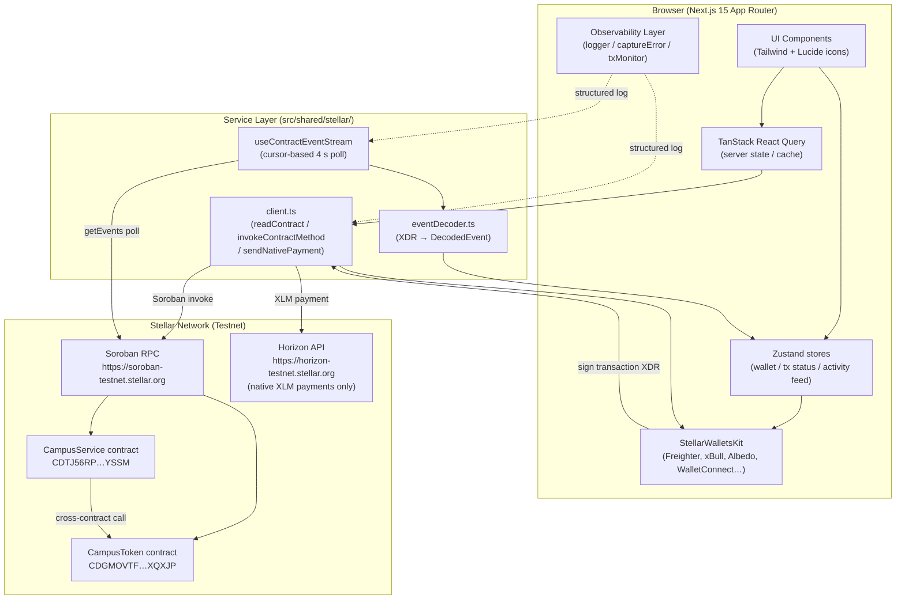
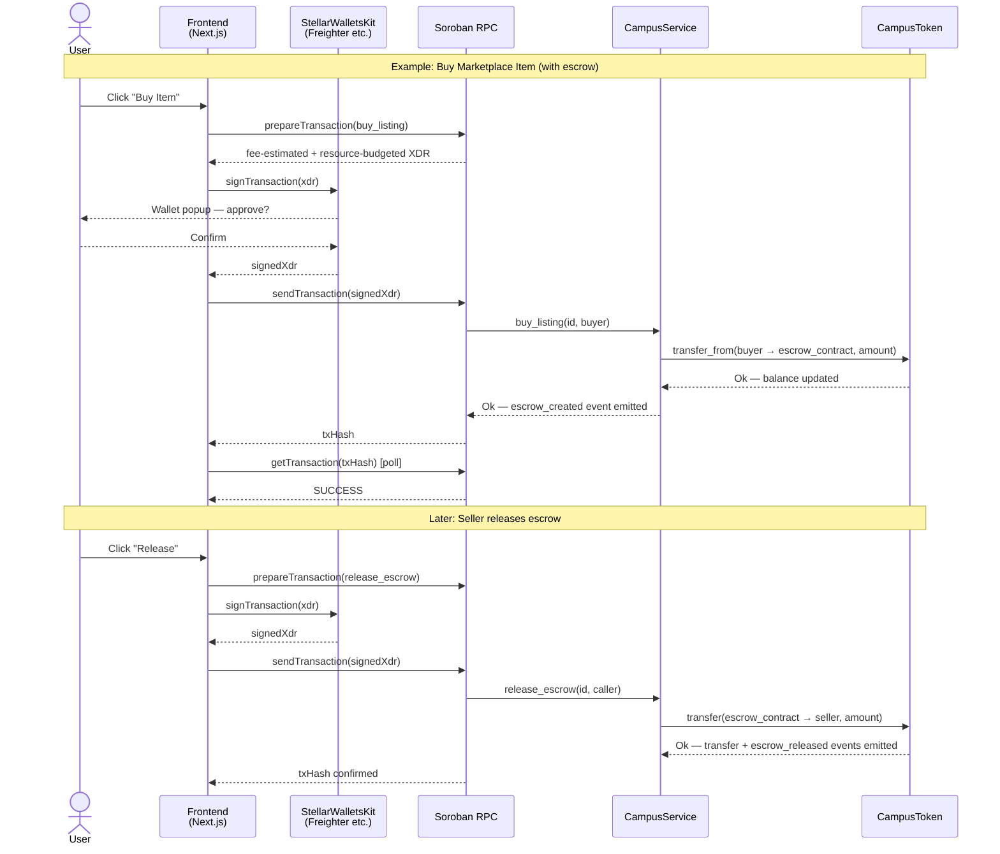
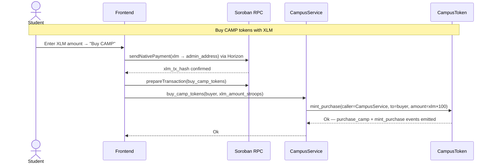

<p align="center">
  <strong>CampusChain — Unified Campus Economy on Stellar</strong><br/>
  <em>A decentralised platform replacing disconnected cash and manual-verification portals with a single Stellar-powered payment, escrow, ticketing, and university registry ecosystem.</em>
</p>

<p align="center">
  <a href="https://stellar.expert/explorer/testnet/contract/CBDU4NVTNNWFCGQEXE4MJDB62QQ4XTACSH3NPLNPGUY2HWSJBS2L2LTJ"></a>
  <a href="https://stellar.expert/explorer/testnet/contract/CAVSOYND5FJRRLEPSSVTRRKFEZ2KTX6WR7LZP5GLCLFDXNYUNPERKDXJ"></a>
  <a href="https://stellar.expert/explorer/testnet/contract/CCNGBCJIUTWFJAFHXYSNLABXHC3MXLMK7TEZYKY5Z4DFCWHLIIBGCJMO"></a>
  
  
</p>

---

## 1. Product Overview & Problem Statement

University campuses run on a patchwork of incompatible payment systems: cash-only canteens, manual ticket desks, paper scholarship forms, and unverifiable second-hand marketplaces. Students overpay in friction, clubs underfund events, and administrators lack auditability.

**CampusChain** solves this with one unified campus economy:

| Pain point | CampusChain solution |
|---|---|
| Cash-only campus payments | CAMP token — a Soroban fungible token for all campus transactions |
| Untrusted second-hand goods | On-chain escrow with automatic fund locking/release |
| Opaque event ticketing | NFT-style tickets minted at purchase, redeemed on-chain |
| Paper scholarship applications | On-chain application + status stepper + automatic disbursement |
| Siloed university identity | On-chain university registry with invite/join request workflows |
| Disjointed rewards programs | Utility rewards with CAMP redemption and burn mechanics |

The platform runs two Soroban smart contracts on Stellar Testnet, wired to a Next.js 15 frontend using StellarWalletsKit for multi-wallet support. Every action the user takes — buying CAMP, paying for a ticket, submitting a scholarship — is a Soroban transaction, signed in-browser, verifiable on-chain.

---

## 2. Architecture


```mermaid
graph TD
    subgraph Browser["Browser (Next.js 15 App Router)"]
        UI["UI Components\n(Tailwind + Lucide icons)"]
        RQ["TanStack React Query\n(server state / cache)"]
        ZS["Zustand stores\n(wallet / tx status / activity feed)"]
        SWK["StellarWalletsKit\n(Freighter, xBull, Albedo, WalletConnect…)"]
        OBS["Observability Layer\n(logger / captureError / txMonitor)"]
    end

    subgraph Services["Service Layer (src/shared/stellar/)"]
        CLIENT["client.ts\n(readContract / invokeContractMethod\n/ sendNativePayment)"]
        EVENTS["useContractEventStream\n(cursor-based 4 s poll)"]
        DECODER["eventDecoder.ts\n(XDR → DecodedEvent)"]
    end

    subgraph Stellar["Stellar Network (Testnet)"]
        RPC["Soroban RPC\nhttps://soroban-testnet.stellar.org"]
        HORIZON["Horizon API\nhttps://horizon-testnet.stellar.org\n(native XLM payments only)"]
        CT["CampusToken contract\nCDGMOVTF…XQXJP"]
        CS["CampusService contract\nCDTJ56RP…YSSM"]
    end

    UI --> RQ
    UI --> ZS
    RQ --> CLIENT
    ZS --> SWK
    CLIENT --> SWK
    SWK -->|"sign transaction XDR"| CLIENT
    CLIENT -->|"Soroban invoke"| RPC
    CLIENT -->|"XLM payment"| HORIZON
    EVENTS -->|"getEvents poll"| RPC
    EVENTS --> DECODER
    DECODER --> ZS
    RPC --> CT
    RPC --> CS
    CS -->|"cross-contract call"| CT
    OBS -.->|"structured log"| CLIENT
    OBS -.->|"structured log"| EVENTS
```

> **Key routing rule**: Contract calls go via **Soroban RPC** (`prepareTransaction` + `sendTransaction`). Native XLM payments go via **Horizon** (`loadAccount` + `submitTransaction`). These cannot be mixed in the same transaction envelope.

---

## 3. Smart Contract Design

### 3.1 CampusIdentity

**Purpose**: Single source of truth for identity, user profiles, roles, and student verification status.

**Address**: [`CBDU4NVTNNWFCGQEXE4MJDB62QQ4XTACSH3NPLNPGUY2HWSJBS2L2LTJ`](https://stellar.expert/explorer/testnet/contract/CBDU4NVTNNWFCGQEXE4MJDB62QQ4XTACSH3NPLNPGUY2HWSJBS2L2LTJ)

#### Storage Model

| Key | Storage tier | Type | Description |
|---|---|---|---|
| `Admin` | Instance | `Address` | Super-admin; set once at `initialize()` |
| `Profile(Address)` | Persistent | `Profile` | Struct storing full name, university ID, department, role, and verified status |

#### Public Functions

`initialize` · `register_profile` · `get_profile` · `set_role` · `set_verified` · `update_profile` · `upgrade`

---

### 3.2 CampusToken (CAMP)

**Purpose**: Fungible campus token (7 decimals), on-chain role registry, faucet, and upgrade-safe WASM entrypoint.

**Address**: [`CAVSOYND5FJRRLEPSSVTRRKFEZ2KTX6WR7LZP5GLCLFDXNYUNPERKDXJ`](https://stellar.expert/explorer/testnet/contract/CAVSOYND5FJRRLEPSSVTRRKFEZ2KTX6WR7LZP5GLCLFDXNYUNPERKDXJ)

#### Storage Model

| Key | Storage tier | Type | Description |
|---|---|---|---|
| `Admin` | Instance | `Address` | Super-admin; set once at `initialize()` |
| `TotalSupply` | Instance | `i128` | Running total minted minus burned |
| `TokenName` / `TokenSymbol` / `TokenDecimals` | Instance | metadata | Token metadata |
| `ServiceContract` | Instance | `Address` | Registered CampusService address (only it may call `mint_purchase`) |
| `Balance(Address)` | Persistent | `i128` | Per-address token balance (stroops, 7 dec) |
| `Allowance(Address, Address)` | Persistent | `AllowanceData` | Spend approval with expiration ledger |
| `Role(Address)` | Persistent | `u32` | Encoded role: 0=Guest, 1=Student, 2=Merchant, 3=Club, 4=Admin |
| `FaucetClaimed(Address)` | Persistent | `bool` | One-time faucet guard |
| `RoleRequest(u64)` | Persistent | `RoleRequestData` | Pending role elevation requests |

#### Role System

| Role ID | Name | Who can assign |
|---|---|---|
| 0 | Guest | Self (free) |
| 1 | Student | Self or super-admin |
| 2 | Merchant | Super-admin only |
| 3 | Club | Super-admin only |
| 4 | Admin | Super-admin only |

#### Public Functions

`initialize` · `admin` · `name` · `symbol` · `decimals` · `total_supply` · `balance` · `transfer` · `approve` · `allowance` · `transfer_from` · `mint` · `mint_purchase` · `burn` · `set_service_contract` · `service_contract` · `set_role` · `get_role` · `request_role_change` · `approve_role_change` · `deny_role_change` · `list_pending_role_requests` · `claim_faucet` · `upgrade`

#### Events Emitted

| Symbol | Topic | Data |
|---|---|---|
| `initialize` | `(initialize, admin)` | `(name, symbol, decimals)` |
| `transfer` | `(transfer, from, to)` | `amount` |
| `approve` | `(approve, from, spender)` | `(amount, expiration_ledger)` |
| `mint` | `(mint, admin, to)` | `amount` |
| `mint_purchase` | `(mint_purchase, to)` | `amount` |
| `burn` | `(burn, from)` | `amount` |
| `role_updated` | `(role_updated, address)` | `role` |
| `faucet_claimed` | `(faucet_claimed, to)` | `amount` |

---

### 3.3 CampusService

**Purpose**: All campus services — escrow, marketplace, event tickets, university registry, scholarships, and rewards. Calls into CampusToken via a compiled WASM import (cross-contract client).

**Address**: [`CCNGBCJIUTWFJAFHXYSNLABXHC3MXLMK7TEZYKY5Z4DFCWHLIIBGCJMO`](https://stellar.expert/explorer/testnet/contract/CCNGBCJIUTWFJAFHXYSNLABXHC3MXLMK7TEZYKY5Z4DFCWHLIIBGCJMO)

#### Storage Model (selected keys)

| Key | Type | Description |
|---|---|---|
| `Admin` / `TokenContract` | Instance | Super-admin and linked CampusToken address |
| `NativeTokenContract` | Instance | Stellar native XLM SAC address |
| `EscrowCounter` / `Escrow(u64)` | Instance / Persistent | Auto-increment ID → `EscrowAgreement` |
| `EventCounter` / `Event(u64)` | Instance / Persistent | Auto-increment ID → `EventDetails` |
| `TicketCounter` / `Ticket(u64)` | Instance / Persistent | Auto-increment ID → `TicketDetails` |
| `ListingCounter` / `Listing(u64)` | Instance / Persistent | Auto-increment ID → `MarketplaceListing` |
| `UniversityCounter` / `University(u64)` | Instance / Persistent | Auto-increment ID → `University` |
| `UniversityMember(Address)` | Persistent | Membership status per address |
| `JoinRequest(u64)` / `Invite(u64)` | Persistent | Pending join/invite records |
| `ScholarshipProgram(u64)` / `ScholarshipApplication(u64)` | Persistent | Scholarship data + application with status stepper |
| `UtilityReward(u64)` / `Redemption(u64)` | Persistent | Reward catalogue + redemption receipts |

#### Economic Constants

| Constant | Value | Meaning |
|---|---|---|
| `PURCHASE_RATE` | 100 | 1 XLM = 100 CAMP |
| `PURCHASE_MIN_XLM` | 10,000,000 stroops | Minimum purchase is 1 XLM |
| `FAUCET_AMOUNT` | 1,000,000,000 stroops | Faucet gives 100 CAMP, claimable once |

#### Events Emitted

| Symbol | Trigger |
|---|---|
| `escrow_created` | `create_escrow()` — funds locked |
| `escrow_released` | `release_escrow()` — funds sent to seller |
| `escrow_refunded` | `refund_escrow()` — funds returned to buyer |
| `event_created` | `create_event()` |
| `ticket_bought` | `buy_ticket()` |
| `ticket_redeemed` | `redeem_ticket()` |
| `item_listed` | `create_listing()` |
| `item_sold` | `buy_listing()` |
| `item_updated` | `update_listing()` |
| `university_registered` | `register_university()` |
| `membership_approved` | `approve_join_request()` |
| `scholarship_applied` | `apply_scholarship()` |
| `scholarship_reviewed` | `update_scholarship_status()` |
| `scholarship_disbursed` | `disburse_scholarship()` |
| `reward_redeemed` | `redeem_reward()` |
| `redemption_fulfilled` | `fulfill_redemption()` |
| `purchase_camp` | `buy_camp_tokens()` |
| `faucet` | `claim_faucet()` |

---

## 4. Inter-Contract Communication


```mermaid
sequenceDiagram
    actor User
    participant FE as Frontend<br/>(Next.js)
    participant SWK as StellarWalletsKit<br/>(Freighter etc.)
    participant RPC as Soroban RPC
    participant CS as CampusService
    participant CT as CampusToken

    Note over User,CT: Example: Buy Marketplace Item (with escrow)

    User->>FE: Click "Buy Item"
    FE->>RPC: prepareTransaction(buy_listing)
    RPC-->>FE: fee-estimated + resource-budgeted XDR
    FE->>SWK: signTransaction(xdr)
    SWK-->>User: Wallet popup — approve?
    User-->>SWK: Confirm
    SWK-->>FE: signedXdr
    FE->>RPC: sendTransaction(signedXdr)
    RPC->>CS: buy_listing(id, buyer)
    CS->>CT: transfer_from(buyer → escrow_contract, amount)
    CT-->>CS: Ok — balance updated
    CS-->>RPC: Ok — escrow_created event emitted
    RPC-->>FE: txHash
    FE->>RPC: getTransaction(txHash) [poll]
    RPC-->>FE: SUCCESS

    Note over User,CT: Later: Seller releases escrow

    User->>FE: Click "Release"
    FE->>RPC: prepareTransaction(release_escrow)
    FE->>SWK: signTransaction(xdr)
    SWK-->>FE: signedXdr
    FE->>RPC: sendTransaction(signedXdr)
    RPC->>CS: release_escrow(id, caller)
    CS->>CT: transfer(escrow_contract → seller, amount)
    CT-->>CS: Ok — transfer + escrow_released events emitted
    RPC-->>FE: txHash confirmed
```


```mermaid
sequenceDiagram
    actor Student
    participant FE as Frontend
    participant RPC as Soroban RPC
    participant CS as CampusService
    participant CT as CampusToken

    Note over Student,CT: Buy CAMP tokens with XLM

    Student->>FE: Enter XLM amount → "Buy CAMP"
    FE->>RPC: sendNativePayment(xlm → admin_address) via Horizon
    RPC-->>FE: xlm_tx_hash confirmed
    FE->>RPC: prepareTransaction(buy_camp_tokens)
    FE->>CS: buy_camp_tokens(buyer, xlm_amount_stroops)
    CS->>CT: mint_purchase(caller=CampusService, to=buyer, amount=xlm×100)
    CT-->>CS: Ok — purchase_camp + mint_purchase events emitted
    CS-->>FE: Ok
```

---

## 5. Features & Tech Stack

### Features

- 🪙 **CAMP Token** — fungible Soroban token (7 decimals), buy with XLM (1:100 rate), dev faucet
- 🔐 **Multi-wallet connect** — Freighter, xBull, Albedo, WalletConnect via StellarWalletsKit
- 🔒 **Escrow marketplace** — on-chain locking, seller-release or buyer-refund
- 🎟️ **Event ticketing** — buy and redeem tickets on-chain, capacity enforcement
- 🎓 **Scholarships** — apply, review, approve, disburse — full lifecycle on-chain
- 🏛️ **University registry** — register institutions, manage memberships with invite/join flows
- 🏆 **Rewards catalogue** — redeem CAMP for utility rewards; CAMP burned on redemption
- 📊 **Admin dashboard** — role management, pending role-change requests, scholarship oversight
- 🔔 **Live activity feed** — real-time Soroban event polling (4 s cursor-based), cache invalidation
- 📱 **Fully responsive** — desktop + mobile breakpoints for every screen
- 🔍 **Observability** — structured logging, `captureError`, tx-lifecycle and event monitoring with pluggable transport (Sentry/Logtail-ready)
- ✅ **49-test suite** — Vitest + React Testing Library, mocked at service boundary (headless CI)

### Tech Stack

| Layer | Technology |
|---|---|
| Smart contracts | Rust · Soroban SDK 21 · `wasm32-unknown-unknown` |
| Blockchain | Stellar Testnet · Soroban RPC · Horizon API |
| Frontend framework | Next.js 15 (App Router) · React 19 |
| Styling | Tailwind CSS v4 |
| Icons | Lucide React |
| Wallet connectivity | `@creit.tech/stellar-wallets-kit` v2.5 |
| Stellar SDK | `@stellar/stellar-sdk` v16 |
| Server state | TanStack React Query v5 |
| Client state | Zustand v5 |
| Testing | Vitest v4 · React Testing Library · `@testing-library/user-event` |
| CI/CD | GitHub Actions (pr-checks + deploy) |
| Hosting | Vercel (frontend) |
| Observability | Custom structured logger + `captureError` + `txMonitor` + `eventMonitor` |

---

## 6. Local Development Setup

### Prerequisites

| Tool | Version | Install |
|---|---|---|
| Rust | ≥ 1.75 | `curl --proto '=https' --tlsv1.2 -sSf https://sh.rustup.rs \| sh` |
| wasm32 target | — | `rustup target add wasm32-unknown-unknown` |
| Stellar CLI | ≥ 22 | `cargo install --locked stellar-cli` |
| Node.js | ≥ 22 (LTS) | [nodejs.org](https://nodejs.org) |
| A Stellar wallet | any | Install [Freighter](https://www.freighter.app/) browser extension |

### 6.1 Clone & Configure

```bash
git clone https://github.com/<your-org>/CampusChain.git
cd CampusChain

# Copy and fill in environment variables
cp frontend/.env.example frontend/.env.local
# Edit frontend/.env.local — see the table in section 6.2
```

### 6.2 Environment Variables

Create `frontend/.env.local` with the following. For local development pointing at testnet, you can use the deployed addresses directly:

```bash
# ── Stellar network ─────────────────────────────────────────────────────────
# Soroban RPC endpoint (Testnet)
NEXT_PUBLIC_STELLAR_RPC_URL=https://soroban-testnet.stellar.org

# Network passphrase — must match exactly (space-sensitive)
NEXT_PUBLIC_STELLAR_PASSPHRASE="Test SDF Network ; September 2015"

# ── Deployed contract addresses (Testnet) ───────────────────────────────────
# CampusIdentity (on-chain profile registry)
NEXT_PUBLIC_CAMPUS_IDENTITY_CONTRACT_ID=CBDU4NVTNNWFCGQEXE4MJDB62QQ4XTACSH3NPLNPGUY2HWSJBS2L2LTJ

# CampusToken (CAMP fungible token)
NEXT_PUBLIC_CAMPUS_TOKEN_CONTRACT_ID=CAVSOYND5FJRRLEPSSVTRRKFEZ2KTX6WR7LZP5GLCLFDXNYUNPERKDXJ

# CampusService (escrow, events, marketplace, scholarships, rewards)
NEXT_PUBLIC_CAMPUS_SERVICE_CONTRACT_ID=CCNGBCJIUTWFJAFHXYSNLABXHC3MXLMK7TEZYKY5Z4DFCWHLIIBGCJMO

# ── Admin account ────────────────────────────────────────────────────────────
# Admin Stellar address — receives XLM during CAMP purchase, issues roles
# NEVER put a private key here. This is a public G... address only.
NEXT_PUBLIC_CAMPUS_ADMIN_ADDRESS=GBPVICMAESR2O4LJRDAV2YGGIQDAEY6ANCAF3GLIXEYRAIDDXM7WQP7X
```

> **All `NEXT_PUBLIC_` variables are baked into the client bundle at build time** — they must never contain secret material. Private keys are always held in user wallets, never in this app.

### 6.3 Run the Contracts (test / build)

```bash
# Run all Soroban contract unit tests
cargo test

# Build both contracts to WASM
cargo build --target wasm32-unknown-unknown --release

# Lint
cargo clippy --all-targets --all-features -- -D warnings

# Format
cargo fmt --all
```

The compiled WASM files will appear at:
- `target/wasm32-unknown-unknown/release/campus_token.wasm`
- `target/wasm32-unknown-unknown/release/campus_service.wasm`

> **Build order matters**: CampusService imports CampusToken's WASM via `soroban_sdk::contractimport!`. Build both in a single `cargo build` call — the workspace handles this automatically.

### 6.4 Run the Frontend

```bash
cd frontend
npm install
npm run dev        # starts Next.js at http://localhost:3000
```

Other useful commands:

```bash
npm run build      # production build (validates no TS/module errors)
npm run lint       # ESLint
npm run test       # Vitest (headless, 49 tests, no wallet popup)
```

### 6.5 Run Tests

```bash
cd frontend
npm run test          # all 49 tests in CI mode (no watcher)
npm run test -- --reporter=verbose   # verbose per-test output
```

Tests mock at the service boundary — no Freighter popup, no real RPC calls. The mock is set up in [`src/test/setup.ts`](frontend/src/test/setup.ts).

---

## 7. CI/CD & Deployment

### 7.1 Automated CI (Pull Requests)

Every PR targeting `main` runs [`.github/workflows/pr-checks.yml`](.github/workflows/pr-checks.yml) in two parallel jobs:

| Job | Steps |
|---|---|
| **contracts** | `cargo fmt --check` → `cargo clippy -D warnings` → `cargo test` |
| **frontend** | `npm ci` → `tsc --noEmit` → `eslint` → `vitest run` → `next build` |

PRs cannot be merged until both jobs pass. Enforce this via GitHub → Settings → Branches → "Require status checks".

### 7.2 Automated Deploy (merge to main)

Merges to `main` trigger [`.github/workflows/deploy.yml`](.github/workflows/deploy.yml):

1. `npm ci` + `next build` — injects real contract addresses from GitHub Secrets
2. `vercel deploy --prebuilt --prod` — deploys to Vercel production URL
3. If `VERCEL_TOKEN` is not configured, the build artefact is uploaded to GitHub Actions (90-day retention) as a fallback.

**Required GitHub Secrets** (Settings → Secrets → Actions):

| Secret | Purpose |
|---|---|
| `VERCEL_TOKEN` | Vercel personal access token |
| `VERCEL_ORG_ID` | From `vercel link` → `.vercel/project.json` |
| `VERCEL_PROJECT_ID` | From `vercel link` → `.vercel/project.json` |
| `NEXT_PUBLIC_STELLAR_RPC_URL` | Soroban RPC endpoint |
| `NEXT_PUBLIC_STELLAR_PASSPHRASE` | Network passphrase |
| `NEXT_PUBLIC_CAMPUS_TOKEN_CONTRACT_ID` | Deployed token contract |
| `NEXT_PUBLIC_CAMPUS_SERVICE_CONTRACT_ID` | Deployed service contract |
| `NEXT_PUBLIC_CAMPUS_ADMIN_ADDRESS` | Admin G… address |

### 7.3 Contract Deployment (Manual — One-Time or After WASM Change)

> ⚠️ **Contract deployment is intentionally NOT automated.** Redeploying a contract changes its address, which requires updating `.env.local`, re-building the frontend, and re-deploying it. Run this manually and deliberately.

```bash
# 1. Build WASMs
cargo build --target wasm32-unknown-unknown --release

# 2. Deploy + initialise both contracts (generates new contract IDs)
CAMPUSCHAIN_ADMIN_KEY=<your-secret-key> ./scripts/deploy.sh

# 3. Update frontend/.env.local with the new contract IDs
# 4. Commit + push → auto-deploy picks up new IDs from secrets
```

For upgrade-only (WASM change, same contract ID):

```bash
./deploy/upgrade.sh <CONTRACT_ID> <NEW_WASM_PATH> CAMPUSCHAIN_TESTNET testnet
```

---

## 8. Security Considerations

### Access Control Model

CampusChain uses a two-layer RBAC:

1. **Soroban `require_auth()`** — every state-changing call verifies the transaction was signed by the expected address. The Soroban host rejects any call that fails auth, before any application logic runs.

2. **Role registry in CampusToken** — role elevation (Guest → Student → Merchant/Club/Admin) requires super-admin signature. Role ID ≤ 1 is self-assignable; role ID ≥ 2 requires admin.

3. **Cross-contract caller verification** — `mint_purchase` in CampusToken checks that the caller is the registered `ServiceContract` address before minting. A rogue caller cannot mint CAMP.

### Admin Key Handling

- The admin keypair (`CAMPUSCHAIN_TESTNET`) is used **only during deployment and initialization**, never stored in the frontend or CI environment.
- The `CAMPUSCHAIN_ADMIN_KEY` env var is consumed exclusively by the local deploy scripts — it is never committed to the repository and never injected into the Next.js build.
- For production, rotate admin key access to a hardware wallet or multi-sig account before mainnet deployment.

### Wallet Key Handling

- **Private keys are never stored by this application.** StellarWalletsKit operates entirely through the browser extension's own secure enclave. The app only ever sees a signed XDR string, never the private key.
- `localStorage` stores the last-connected wallet ID and network preference only — never any secret material.
- Wallet disconnection clears all stored wallet state from Zustand and localStorage.

### Upgrade Safety

- Both contracts expose an `upgrade(new_wasm_hash: BytesN<32>)` function gated by `admin.require_auth()`.
- WASM upgrades do not change the contract address — state persists across upgrades.
- The upgrade workflow (`./deploy/upgrade.sh`) requires the admin key to be present in the local shell environment; it cannot be triggered from CI.

### Input Validation

- All amounts are validated `> 0` on-chain before any storage mutation.
- Role IDs are range-checked `<= 4` on-chain.
- Escrow status transitions are validated against the current `EscrowAgreement.status` — double-release and double-refund are rejected with `InvalidEscrowStatus`.
- Ticket redemption is idempotent-guarded by `TicketDetails.redeemed: bool`.

---

## 9. Screenshots

> Drop PNG/WebP screenshots into `docs/screenshots/` and uncomment the lines below.

| Screen | Path |
|---|---|
| Login / Wallet Connect | `docs/screenshots/01_login.png` |
| Wallet Dashboard (balance, recent tx) | `docs/screenshots/02_wallet_dashboard.png` |
| Send / Receive CAMP | `docs/screenshots/03_send_receive.png` |
| Scan & Pay (QR) | `docs/screenshots/04_scan_pay.png` |
| Marketplace Grid | `docs/screenshots/05_marketplace_grid.png` |
| Marketplace Listing Detail / Sell | `docs/screenshots/06_marketplace_detail.png` |
| Events | `docs/screenshots/07_events.png` |
| Rewards Catalogue | `docs/screenshots/08_rewards.png` |
| Scholarships | `docs/screenshots/09_scholarships.png` |
| Transaction History | `docs/screenshots/10_tx_history.png` |
| Merchant Dashboard | `docs/screenshots/11_merchant_dashboard.png` |
| Admin Dashboard | `docs/screenshots/12_admin_dashboard.png` |
| Settings | `docs/screenshots/13_settings.png` |

<!--


-->

---

## 10. Contract Addresses & On-Chain Verification

### Deployed Contracts (Stellar Testnet)

| Contract | Address | Explorer |
|---|---|---|
| **CampusIdentity** | `CBDU4NVTNNWFCGQEXE4MJDB62QQ4XTACSH3NPLNPGUY2HWSJBS2L2LTJ` | [StellarExpert ↗](https://stellar.expert/explorer/testnet/contract/CBDU4NVTNNWFCGQEXE4MJDB62QQ4XTACSH3NPLNPGUY2HWSJBS2L2LTJ) |
| **CampusToken** (CAMP) | `CAVSOYND5FJRRLEPSSVTRRKFEZ2KTX6WR7LZP5GLCLFDXNYUNPERKDXJ` | [StellarExpert ↗](https://stellar.expert/explorer/testnet/contract/CAVSOYND5FJRRLEPSSVTRRKFEZ2KTX6WR7LZP5GLCLFDXNYUNPERKDXJ) |
| **CampusService** | `CCNGBCJIUTWFJAFHXYSNLABXHC3MXLMK7TEZYKY5Z4DFCWHLIIBGCJMO` | [StellarExpert ↗](https://stellar.expert/explorer/testnet/contract/CCNGBCJIUTWFJAFHXYSNLABXHC3MXLMK7TEZYKY5Z4DFCWHLIIBGCJMO) |
| **Native XLM SAC** | `CDLZFC3SYJYDZT7K67VZ75HPJVIEUVNIXF47ZG2FB2RMQQVU2HHGCYSC` | [StellarExpert ↗](https://stellar.expert/explorer/testnet/contract/CDLZFC3SYJYDZT7K67VZ75HPJVIEUVNIXF47ZG2FB2RMQQVU2HHGCYSC) |

### Admin Account

| Item | Value |
|---|---|
| **Identity** | `CAMPUSCHAIN_TESTNET` |
| **Public Address** | `GBPVICMAESR2O4LJRDAV2YGGIQDAEY6ANCAF3GLIXEYRAIDDXM7WQP7X` |
| **Explorer** | [StellarExpert ↗](https://stellar.expert/explorer/testnet/account/GBPVICMAESR2O4LJRDAV2YGGIQDAEY6ANCAF3GLIXEYRAIDDXM7WQP7X) |

### Deployment Transactions

#### CampusIdentity

| Action | Transaction Hash | Explorer |
|---|---|---|
| WASM Upload | `8bad1cb61b841a8ef03c54cc502a353241feea2d48107bf4adbdc6f40dfd0317` | [View ↗](https://stellar.expert/explorer/testnet/tx/8bad1cb61b841a8ef03c54cc502a353241feea2d48107bf4adbdc6f40dfd0317) |
| Contract Instantiate | `93afa3e2308a8ec323728ac41b10f381ddc37f9dd63064886e8905a95a733675` | [View ↗](https://stellar.expert/explorer/testnet/tx/93afa3e2308a8ec323728ac41b10f381ddc37f9dd63064886e8905a95a733675) |
| `initialize()` | `4e7be04979a7fab6814c287caa2e43aaf2d9638509e19f365b78c8d2ab665281` | [View ↗](https://stellar.expert/explorer/testnet/tx/4e7be04979a7fab6814c287caa2e43aaf2d9638509e19f365b78c8d2ab665281) |

#### CampusToken

| Action | Transaction Hash | Explorer |
|---|---|---|
| Contract Instantiate | `e40bb4b3762010ac60f974929dd63467c1b62fbb1e458ce79cd19d538ba08fea` | [View ↗](https://stellar.expert/explorer/testnet/tx/e40bb4b3762010ac60f974929dd63467c1b62fbb1e458ce79cd19d538ba08fea) |
| `initialize()` | `2a66548fd7853a86cd766a210dbfca281b816852eeac2c3831a40010bb35491b` | [View ↗](https://stellar.expert/explorer/testnet/tx/2a66548fd7853a86cd766a210dbfca281b816852eeac2c3831a40010bb35491b) |
| `set_service_contract()` | `adfa0905e0916ad58c2694f77a05a56b42475c1d9e630eef2254b4ffd6c711c4` | [View ↗](https://stellar.expert/explorer/testnet/tx/adfa0905e0916ad58c2694f77a05a56b42475c1d9e630eef2254b4ffd6c711c4) |

#### CampusService

| Action | Transaction Hash | Explorer |
|---|---|---|
| WASM Upload | `5664bd23921a9f983573835f915b20f86624b258d9590ec5a2a6b3efc823558d` | [View ↗](https://stellar.expert/explorer/testnet/tx/5664bd23921a9f983573835f915b20f86624b258d9590ec5a2a6b3efc823558d) |
| Contract Instantiate | `6b9a3f72c8b7ee3fc788cb39083b3f05e62dfd47577f9bd38528db4e2f960450` | [View ↗](https://stellar.expert/explorer/testnet/tx/6b9a3f72c8b7ee3fc788cb39083b3f05e62dfd47577f9bd38528db4e2f960450) |
| `initialize()` | `37fdc984517801a18cabf409e04c7c1b35d5c6f437304a352166a5e134c4e8e3` | [View ↗](https://stellar.expert/explorer/testnet/tx/37fdc984517801a18cabf409e04c7c1b35d5c6f437304a352166a5e134c4e8e3) |
| `set_native_token()` | `c9f744dc505c9b2717107962f9b4872f4b83e79d584941185b87f60ff0fd690a` | [View ↗](https://stellar.expert/explorer/testnet/tx/c9f744dc505c9b2717107962f9b4872f4b83e79d584941185b87f60ff0fd690a) |
| `set_identity_contract()` | `8ad6c64219bea86e668cc5e0c5b931298b410a114c629f6481649c4a2dc5f014` | [View ↗](https://stellar.expert/explorer/testnet/tx/8ad6c64219bea86e668cc5e0c5b931298b410a114c629f6481649c4a2dc5f014) |

### WASM Hashes

| Contract | WASM Hash |
|---|---|
| CampusIdentity | `78dd41930dfdb88384ec6c0d9827b35e573bf18d7d396a4af7d7c1f72ec62529` |
| CampusToken | `d4c216fe541eeb748a27b2a49f217f5f266b60d96acc61ba5e1893b5106a2fd7` |
| CampusService | `a11f140bf31a433282e99aa8b85937e263bb3e0584bf40b76db69831c9847453` |

---

## 11. Demo

> Replace these placeholders when a live environment is available.

| Resource | Link |
|---|---|
| 🌐 Live demo (Vercel) | `https://campuschain.vercel.app` *(placeholder — update after first deploy)* |
| 🎥 Demo video | `<!-- embed a Loom / YouTube link here -->` |
| 🧪 Testnet faucet | [Stellar Laboratory Friendbot](https://laboratory.stellar.org/#account-creator?network=testnet) |
| 📖 Stellar docs | [developers.stellar.org](https://developers.stellar.org) |
| 🔍 Contract explorer | [StellarExpert Testnet](https://stellar.expert/explorer/testnet) |

---

## Contributing

1. Fork the repo and create a feature branch.
2. Follow the [Conventional Commits](https://www.conventionalcommits.org/) specification for all commit messages.
3. Run `cargo fmt`, `cargo clippy`, and `npm run lint` before pushing.
4. Open a PR — the `pr-checks` workflow must pass before review.

## License

MIT © CampusChain Contributors
