<p align="center">
  <strong>CampusChain — Unified Campus Economy on Stellar</strong><br/>
  <em>A decentralised platform replacing disconnected cash and manual-verification portals with a single Stellar-powered payment, escrow, ticketing, and university registry ecosystem.</em>
</p>

<p align="center">
  <a href="https://stellar.expert/explorer/testnet/contract/CBSP6PGVKP3OHV7CHFIVNYA6GA3WQ2VGWMGW4YTG7IF6FBEKUVFKNH6Q"></a>
  <a href="https://stellar.expert/explorer/testnet/contract/CCNX6UK6XNBXG63I75R5EVRHXQKD23ECUUJSH6NPV32OWJWJL72ZQCP2"></a>
  <a href="https://stellar.expert/explorer/testnet/contract/CATHDHIUADXXENVYN7Z2ABSERDYUGK7OQMWFODBW7I66HS43WSUZNGLL"></a>
  
  
</p>

---

## 1. Product Overview & Problem Statement

University campuses run on a patchwork of incompatible payment systems: cash-only canteens, manual ticket desks, paper scholarship forms, and unverifiable second-hand marketplaces. Students overpay in friction, clubs underfund events, and administrators lack auditability.

**CampusChain** solves this with one unified campus economy:

| Pain point | CampusChain solution |
|---|---|
| Cash-only campus payments | CAMP token — a Soroban fungible token for all campus transactions |
| Untrusted second-hand goods | On-chain escrow with automatic fund locking/release |
| Opaque event ticketing | NFT-style tickets minted at purchase, redeemed on-chain |
| Paper scholarship applications | On-chain application + status stepper + automatic disbursement |
| Siloed university identity | On-chain university registry with invite/join request workflows |
| Disjointed rewards programs | Utility rewards with CAMP redemption and burn mechanics |

The platform runs two Soroban smart contracts on Stellar Testnet, wired to a Next.js 15 frontend using StellarWalletsKit for multi-wallet support. Every action the user takes — buying CAMP, paying for a ticket, submitting a scholarship — is a Soroban transaction, signed in-browser, verifiable on-chain.

---

## 2. Architecture

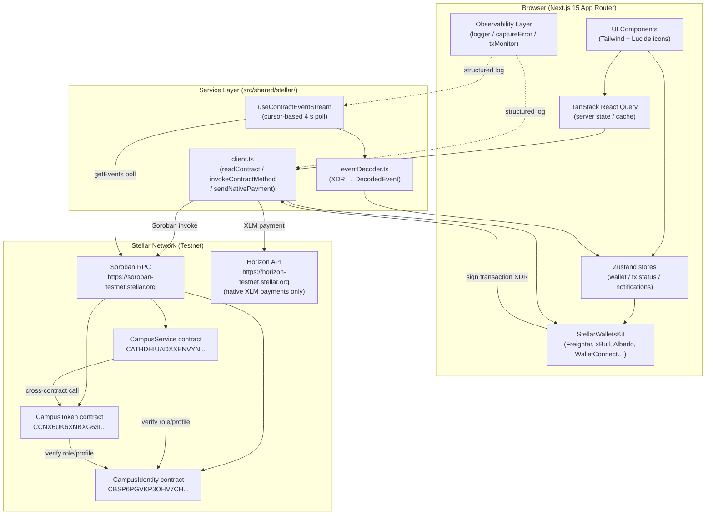
```mermaid
graph TD
    subgraph Browser["Browser (Next.js 15 App Router)"]
        UI["UI Components\n(Tailwind + Lucide icons)"]
        RQ["TanStack React Query\n(server state / cache)"]
        ZS["Zustand stores\n(wallet / tx status / notifications)"]
        SWK["StellarWalletsKit\n(Freighter, xBull, Albedo, WalletConnect…)"]
        OBS["Observability Layer\n(logger / captureError / txMonitor)"]
    end

    subgraph Services["Service Layer (src/shared/stellar/)"]
        CLIENT["client.ts\n(readContract / invokeContractMethod\n/ sendNativePayment)"]
        EVENTS["useContractEventStream\n(cursor-based 4 s poll)"]
        DECODER["eventDecoder.ts\n(XDR → DecodedEvent)"]
    end

    subgraph Stellar["Stellar Network (Testnet)"]
        RPC["Soroban RPC\nhttps://soroban-testnet.stellar.org"]
        HORIZON["Horizon API\nhttps://horizon-testnet.stellar.org\n(native XLM payments only)"]
        CI["CampusIdentity contract\nCBSP6PGVKP3OHV7CH..."]
        CT["CampusToken contract\nCCNX6UK6XNBXG63I..."]
        CS["CampusService contract\nCATHDHIUADXXENVYN..."]
    end

    UI --> RQ
    UI --> ZS
    RQ --> CLIENT
    ZS --> SWK
    CLIENT --> SWK
    SWK -->|"sign transaction XDR"| CLIENT
    CLIENT -->|"Soroban invoke"| RPC
    CLIENT -->|"XLM payment"| HORIZON
    EVENTS -->|"getEvents poll"| RPC
    EVENTS --> DECODER
    DECODER --> ZS
    RPC --> CI
    RPC --> CT
    RPC --> CS
    CS -->|"cross-contract call"| CT
    CS -->|"verify role/profile"| CI
    CT -->|"verify role/profile"| CI
    OBS -.->|"structured log"| CLIENT
    OBS -.->|"structured log"| EVENTS
```

### 2.1 Role Hierarchy & Scoping Model

CampusChain establishes a clear separation of concerns across 5 roles, with Platform Admin acting as the global system bootstrap, University Admins managing scoped campuses, and students/merchants/organizers executing within their university boundary.

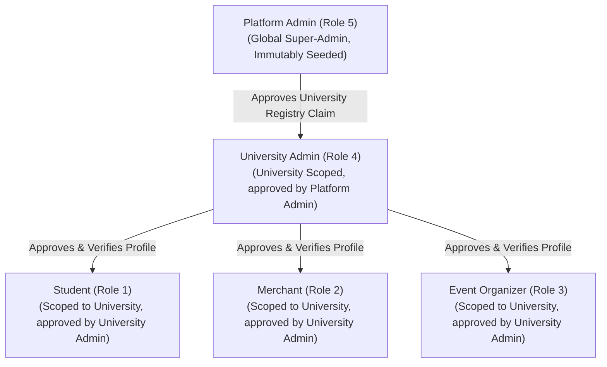
```mermaid
graph TD
    PA["Platform Admin (Role 5)\n(Global Super-Admin, Immutably Seeded)"]
    UA["University Admin (Role 4)\n(University Scoped, approved by Platform Admin)"]
    ST["Student (Role 1)\n(Scoped to University, approved by University Admin)"]
    ME["Merchant (Role 2)\n(Scoped to University, approved by University Admin)"]
    EO["Event Organizer (Role 3)\n(Scoped to University, approved by University Admin)"]

    PA -->|"Approves University Registry Claim"| UA
    UA -->|"Approves & Verifies Profile"| ST
    UA -->|"Approves & Verifies Profile"| ME
    UA -->|"Approves & Verifies Profile"| EO
```

### 2.2 University Scoping & Inter-Contract Verification

To guarantee that assets, event tickets, and canteens remain isolated within each university boundary, `CampusService` invokes `CampusIdentity` on-chain to check that both active profiles share the same uppercase `university_code` before executing transactions.

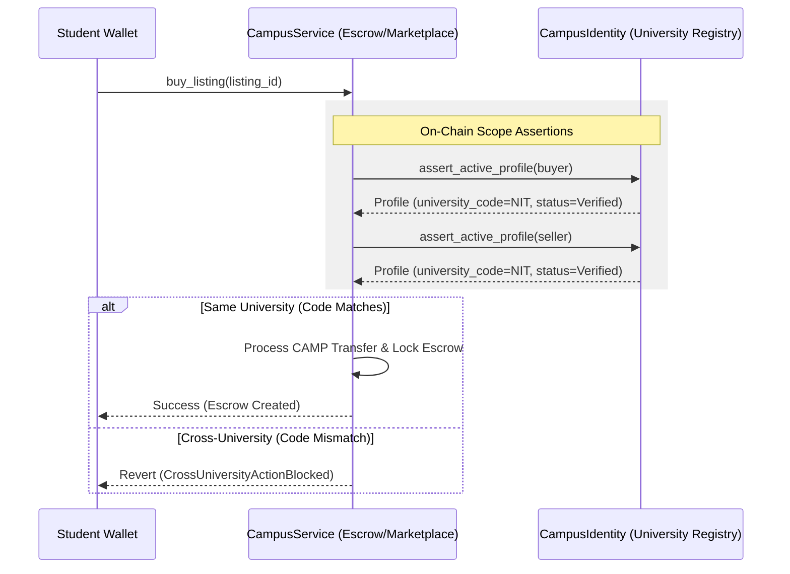
```mermaid
sequenceDiagram
    participant User as Student Wallet
    participant CS as CampusService (Escrow/Marketplace)
    participant CI as CampusIdentity (University Registry)

    User->>CS: buy_listing(listing_id)
    rect rgb(240, 240, 240)
        Note over CS,CI: On-Chain Scope Assertions
        CS->>CI: assert_active_profile(buyer)
        CI-->>CS: Profile (university_code=NIT, status=Verified)
        CS->>CI: assert_active_profile(seller)
        CI-->>CS: Profile (university_code=NIT, status=Verified)
    end
    
    alt Same University (Code Matches)
        CS->>CS: Process CAMP Transfer & Lock Escrow
        CS-->>User: Success (Escrow Created)
    else Cross-University (Code Mismatch)
        CS-->>User: Revert (CrossUniversityActionBlocked)
    end
```

> **Key routing rule**: Contract calls go via **Soroban RPC** (`prepareTransaction` + `sendTransaction`). Native XLM payments go via **Horizon** (`loadAccount` + `submitTransaction`). These cannot be mixed in the same transaction envelope.

---

## 3. Smart Contract Design

### 3.1 CampusIdentity

**Purpose**: Single source of truth for identity, user profiles, roles, and student verification status.

**Address**: [`CBSP6PGVKP3OHV7CHFIVNYA6GA3WQ2VGWMGW4YTG7IF6FBEKUVFKNH6Q`](https://stellar.expert/explorer/testnet/contract/CBSP6PGVKP3OHV7CHFIVNYA6GA3WQ2VGWMGW4YTG7IF6FBEKUVFKNH6Q)

#### Storage Model

| Key | Storage tier | Type | Description |
|---|---|---|---|
| `Admin` | Instance | `Address` | Super-admin; set once at `initialize()` |
| `Profile(Address)` | Persistent | `Profile` | Struct storing full name, university ID, department, role, and verified status |

#### Public Functions

`initialize` · `register_profile` · `get_profile` · `set_role` · `set_verified` · `update_profile` · `upgrade`

---

### 3.2 CampusToken (CAMP)

**Purpose**: Fungible campus token (7 decimals), on-chain role registry, faucet, and upgrade-safe WASM entrypoint.

**Address**: [`CCNX6UK6XNBXG63I75R5EVRHXQKD23ECUUJSH6NPV32OWJWJL72ZQCP2`](https://stellar.expert/explorer/testnet/contract/CCNX6UK6XNBXG63I75R5EVRHXQKD23ECUUJSH6NPV32OWJWJL72ZQCP2)

#### Storage Model

| Key | Storage tier | Type | Description |
|---|---|---|---|
| `Admin` | Instance | `Address` | Super-admin; set once at `initialize()` |
| `TotalSupply` | Instance | `i128` | Running total minted minus burned |
| `TokenName` / `TokenSymbol` / `TokenDecimals` | Instance | metadata | Token metadata |
| `ServiceContract` | Instance | `Address` | Registered CampusService address (only it may call `mint_purchase`) |
| `Balance(Address)` | Persistent | `i128` | Per-address token balance (stroops, 7 dec) |
| `Allowance(Address, Address)` | Persistent | `AllowanceData` | Spend approval with expiration ledger |
| `Role(Address)` | Persistent | `u32` | Encoded role: 0=Guest, 1=Student, 2=Merchant, 3=Club, 4=Admin |
| `FaucetClaimed(Address)` | Persistent | `bool` | One-time faucet guard |
| `RoleRequest(u64)` | Persistent | `RoleRequestData` | Pending role elevation requests |

#### Role System

| Role ID | Name | Who can assign |
|---|---|---|
| 0 | Guest | Self (free) |
| 1 | Student | Self or super-admin |
| 2 | Merchant | Super-admin only |
| 3 | Club | Super-admin only |
| 4 | Admin | Super-admin only |

#### Public Functions

`initialize` · `admin` · `name` · `symbol` · `decimals` · `total_supply` · `balance` · `transfer` · `approve` · `allowance` · `transfer_from` · `mint` · `mint_purchase` · `burn` · `set_service_contract` · `service_contract` · `set_role` · `get_role` · `request_role_change` · `approve_role_change` · `deny_role_change` · `list_pending_role_requests` · `claim_faucet` · `upgrade`

#### Events Emitted

| Symbol | Topic | Data |
|---|---|---|
| `initialize` | `(initialize, admin)` | `(name, symbol, decimals)` |
| `transfer` | `(transfer, from, to)` | `amount` |
| `approve` | `(approve, from, spender)` | `(amount, expiration_ledger)` |
| `mint` | `(mint, admin, to)` | `amount` |
| `mint_purchase` | `(mint_purchase, to)` | `amount` |
| `burn` | `(burn, from)` | `amount` |
| `role_updated` | `(role_updated, address)` | `role` |
| `faucet_claimed` | `(faucet_claimed, to)` | `amount` |

---

### 3.3 CampusService

**Purpose**: All campus services — escrow, marketplace, event tickets, university registry, scholarships, and rewards. Calls into CampusToken via a compiled WASM import (cross-contract client).

**Address**: [`CATHDHIUADXXENVYN7Z2ABSERDYUGK7OQMWFODBW7I66HS43WSUZNGLL`](https://stellar.expert/explorer/testnet/contract/CATHDHIUADXXENVYN7Z2ABSERDYUGK7OQMWFODBW7I66HS43WSUZNGLL)

#### Storage Model (selected keys)

| Key | Type | Description |
|---|---|---|
| `Admin` / `TokenContract` | Instance | Super-admin and linked CampusToken address |
| `NativeTokenContract` | Instance | Stellar native XLM SAC address |
| `EscrowCounter` / `Escrow(u64)` | Instance / Persistent | Auto-increment ID → `EscrowAgreement` |
| `EventCounter` / `Event(u64)` | Instance / Persistent | Auto-increment ID → `EventDetails` |
| `TicketCounter` / `Ticket(u64)` | Instance / Persistent | Auto-increment ID → `TicketDetails` |
| `ListingCounter` / `Listing(u64)` | Instance / Persistent | Auto-increment ID → `MarketplaceListing` |
| `UniversityCounter` / `University(u64)` | Instance / Persistent | Auto-increment ID → `University` |
| `UniversityMember(Address)` | Persistent | Membership status per address |
| `JoinRequest(u64)` / `Invite(u64)` | Persistent | Pending join/invite records |
| `ScholarshipProgram(u64)` / `ScholarshipApplication(u64)` | Persistent | Scholarship data + application with status stepper |
| `UtilityReward(u64)` / `Redemption(u64)` | Persistent | Reward catalogue + redemption receipts |

#### Economic Constants

| Constant | Value | Meaning |
|---|---|---|
| `PURCHASE_RATE` | 100 | 1 XLM = 100 CAMP |
| `PURCHASE_MIN_XLM` | 10,000,000 stroops | Minimum purchase is 1 XLM |
| `FAUCET_AMOUNT` | 1,000,000,000 stroops | Faucet gives 100 CAMP, claimable once |

#### Events Emitted

| Symbol | Trigger |
|---|---|
| `escrow_created` | `create_escrow()` — funds locked |
| `escrow_released` | `release_escrow()` — funds sent to seller |
| `escrow_refunded` | `refund_escrow()` — funds returned to buyer |
| `event_created` | `create_event()` |
| `ticket_bought` | `buy_ticket()` |
| `ticket_redeemed` | `redeem_ticket()` |
| `item_listed` | `create_listing()` |
| `item_sold` | `buy_listing()` |
| `item_updated` | `update_listing()` |
| `university_registered` | `register_university()` |
| `membership_approved` | `approve_join_request()` |
| `scholarship_applied` | `apply_scholarship()` |
| `scholarship_reviewed` | `update_scholarship_status()` |
| `scholarship_disbursed` | `disburse_scholarship()` |
| `reward_redeemed` | `redeem_reward()` |
| `redemption_fulfilled` | `fulfill_redemption()` |
| `purchase_camp` | `buy_camp_tokens()` |
| `faucet` | `claim_faucet()` |

### 3.4 Roles & Verification

To establish a secure, decentralized campus ecosystem, CampusChain operates a hierarchical Role-Based Access Control (RBAC) and verification system managed directly on-chain within `CampusIdentity`.

#### The 5 System Roles

1. **Platform Admin (Role 5)**: The global super-admin. Possesses the exclusive privilege to approve, reject, or suspend universities.
2. **University Admin (Role 4)**: The administrator for a specific university. Manages profile verifications for Students, Merchants, and Event Organizers scoped to their university code, and controls scholarship programs.
3. **Student (Role 1)**: Scoped to a verified university. Can purchase items on the marketplace, buy event tickets, apply for scholarships, and place food orders at canteens.
4. **Merchant (Role 2)**: Scoped to a verified university. Can create marketplace listings, publish canteen menus, and receive CAMP token payments.
5. **Event Organizer (Role 3)**: Scoped to a verified university. Can create events, configure ticket prices/capacities, and track attendance.

#### Immutable Platform Admin Bootstrap

The Platform Admin address is bootstrapped immutably at the time of contract deployment. 
- During `initialize(platform_admin: Address)` execution on `CampusIdentity`, the admin address is stored once in persistent storage (`DataKey::PlatformAdmin`).
- There is **no transfer function** or `set_platform_admin` function anywhere in the contract.
- The `upgrade` function is omitted from `CampusIdentity`, ensuring that the compiled verification logic cannot be modified via in-place contract upgrades. The Platform Admin is permanently bound to the deployment key.

#### Two-Tier Approval Model

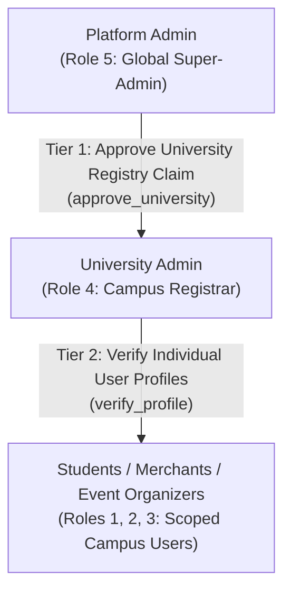
```mermaid
graph TD
    PA["Platform Admin<br>(Role 5: Global Super-Admin)"]
    UA["University Admin<br>(Role 4: Campus Registrar)"]
    Users["Students / Merchants / Event Organizers<br>(Roles 1, 2, 3: Scoped Campus Users)"]

    PA -->|"Tier 1: Approve University Registry Claim<br>(approve_university)"| UA
    UA -->|"Tier 2: Verify Individual User Profiles<br>(verify_profile)"| Users
```

- **Tier 1 (University Registry Approval)**: When a new university admin registers, their university code is claimed and placed in a `PendingApproval` state. The Platform Admin must invoke `approve_university(code)` to activate the university.
- **Tier 2 (User Profile Verification)**: When students or merchants register under an approved university code, their profile is created in a `Pending` state. The university's own University Admin must review and call `verify_profile(user)` to unlock their profile. Until verified, users are blocked on-chain from initiating trades, ticketing, or ordering.

#### Architectural Rationale

This model utilizes **delegated trust** to scale campus verification platform-wide:
- **No Platform Overhead**: The global Platform Admin does not verify individual students. They trust the university registrars (University Admins) to manage their respective campuses.
- **On-Chain Sovereignty**: Verification actions are on-chain, signed transactions, leaving a transparent audit trail of which administrator verified which student.

---

### 3.5 University Scoping

A core tenet of the CampusChain design is **cross-university isolation** (university scoping), ensuring that transactions, assets, canteens, and tickets are strictly bounded within each campus.

#### Defense-in-Depth Enforcement

1. **On-Chain Isolation (Identity Contract)**:
   - Before completing any financial trade, ticket transfer, or food ordering payout, `CampusService` invokes `CampusIdentity.assert_active_profile(address)` to fetch the user's `university_code` and `VerificationStatus`.
   - The contract asserts that both the buyer and seller share the exact same uppercase `university_code` and are both `Verified`.
   - If the codes mismatch, the transaction is immediately reverted at the virtual machine layer, throwing a `CrossUniversityActionBlocked` error.

2. **UI-Layer Scoping**:
   - The Next.js frontend filters listings, events, and canteens at the query layer based on the connected user's profile `university_code`. Users never see canteens or items from other universities.
   - Scan & Pay QR parsers validate the merchant's university code pre-submission. If a user scans a QR code from a merchant belonging to a different university, the UI halts checkout and displays a clear warning: *"This merchant is not part of your university"*.
   - Direct address-to-address transfers auto-complete and search only within the user's same university directory.

---

## 4. Inter-Contract Communication

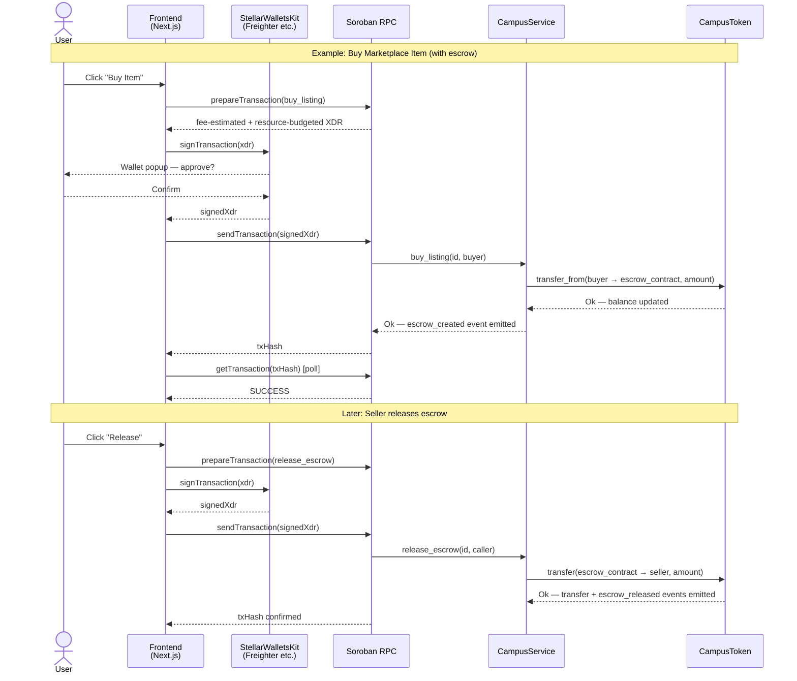
```mermaid
sequenceDiagram
    actor User
    participant FE as Frontend<br/>(Next.js)
    participant SWK as StellarWalletsKit<br/>(Freighter etc.)
    participant RPC as Soroban RPC
    participant CS as CampusService
    participant CT as CampusToken

    Note over User,CT: Example: Buy Marketplace Item (with escrow)

    User->>FE: Click "Buy Item"
    FE->>RPC: prepareTransaction(buy_listing)
    RPC-->>FE: fee-estimated + resource-budgeted XDR
    FE->>SWK: signTransaction(xdr)
    SWK-->>User: Wallet popup — approve?
    User-->>SWK: Confirm
    SWK-->>FE: signedXdr
    FE->>RPC: sendTransaction(signedXdr)
    RPC->>CS: buy_listing(id, buyer)
    CS->>CT: transfer_from(buyer → escrow_contract, amount)
    CT-->>CS: Ok — balance updated
    CS-->>RPC: Ok — escrow_created event emitted
    RPC-->>FE: txHash
    FE->>RPC: getTransaction(txHash) [poll]
    RPC-->>FE: SUCCESS

    Note over User,CT: Later: Seller releases escrow

    User->>FE: Click "Release"
    FE->>RPC: prepareTransaction(release_escrow)
    FE->>SWK: signTransaction(xdr)
    SWK-->>FE: signedXdr
    FE->>RPC: sendTransaction(signedXdr)
    RPC->>CS: release_escrow(id, caller)
    CS->>CT: transfer(escrow_contract → seller, amount)
    CT-->>CS: Ok — transfer + escrow_released events emitted
    RPC-->>FE: txHash confirmed
```

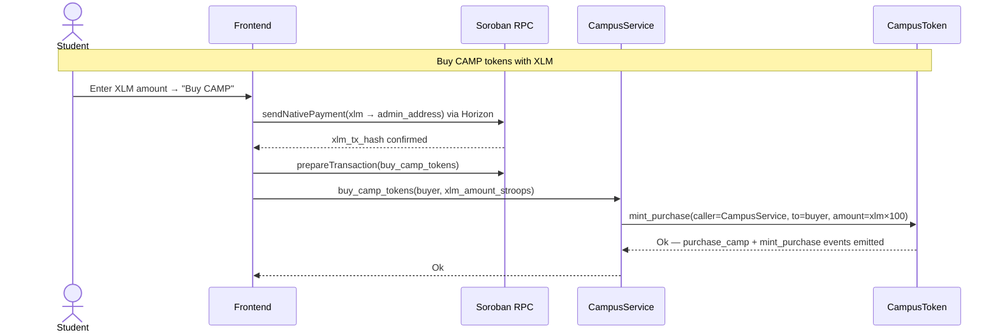
```mermaid
sequenceDiagram
    actor Student
    participant FE as Frontend
    participant RPC as Soroban RPC
    participant CS as CampusService
    participant CT as CampusToken

    Note over Student,CT: Buy CAMP tokens with XLM

    Student->>FE: Enter XLM amount → "Buy CAMP"
    FE->>RPC: sendNativePayment(xlm → admin_address) via Horizon
    RPC-->>FE: xlm_tx_hash confirmed
    FE->>RPC: prepareTransaction(buy_camp_tokens)
    FE->>CS: buy_camp_tokens(buyer, xlm_amount_stroops)
    CS->>CT: mint_purchase(caller=CampusService, to=buyer, amount=xlm×100)
    CT-->>CS: Ok — purchase_camp + mint_purchase events emitted
    CS-->>FE: Ok
```

---

## 5. Features & Tech Stack

### Features

- 🪙 **CAMP Token** — fungible Soroban token (7 decimals), buy with XLM (1:100 rate), dev faucet
- 🔐 **Multi-wallet connect** — Freighter, xBull, Albedo, WalletConnect via StellarWalletsKit
- 🔒 **Escrow marketplace** — on-chain locking, seller-release or buyer-refund
- 🎟️ **Event ticketing** — buy and redeem tickets on-chain, capacity enforcement
- 🎓 **Scholarships** — apply, review, approve, disburse — full lifecycle on-chain
- 🏛️ **University registry** — register institutions, manage memberships with invite/join flows
- 🏆 **Rewards catalogue** — redeem CAMP for utility rewards; CAMP burned on redemption
- 📊 **Admin dashboard** — role management, pending role-change requests, scholarship oversight
- 🔔 **Live activity feed** — real-time Soroban event polling (4 s cursor-based), cache invalidation
- 📱 **Fully responsive** — desktop + mobile breakpoints for every screen
- 🔍 **Observability** — structured logging, `captureError`, tx-lifecycle and event monitoring with pluggable transport (Sentry/Logtail-ready)
- ✅ **49-test suite** — Vitest + React Testing Library, mocked at service boundary (headless CI)

### Tech Stack

| Layer | Technology |
|---|---|
| Smart contracts | Rust · Soroban SDK 21 · `wasm32-unknown-unknown` |
| Blockchain | Stellar Testnet · Soroban RPC · Horizon API |
| Frontend framework | Next.js 15 (App Router) · React 19 |
| Styling | Tailwind CSS v4 |
| Icons | Lucide React |
| Wallet connectivity | `@creit.tech/stellar-wallets-kit` v2.5 |
| Stellar SDK | `@stellar/stellar-sdk` v16 |
| Server state | TanStack React Query v5 |
| Client state | Zustand v5 |
| Testing | Vitest v4 · React Testing Library · `@testing-library/user-event` |
| CI/CD | GitHub Actions (pr-checks + deploy) |
| Hosting | Vercel (frontend) |
| Observability | Custom structured logger + `captureError` + `txMonitor` + `eventMonitor` |

### 🛠️ Tech Stack

[](https://skillicons.dev)


### 5.1 Campus Food Ordering

CampusChain includes a comprehensive Canteen Canteen/Food Ordering system integrated directly with the university scoped identity checks and payment flows.

#### 1. Menu Management (Merchant Dashboard)
- Verified canteen merchants can manage their menus on-chain by publishing new items (setting dish title, category, description, and price in CAMP tokens).
- Merchants can adjust item pricing and toggle availability (activating/deactivating a dish).
- In addition to menu administration, merchants have a live incoming orders queue which updates in real-time through on-chain event streams as new orders are placed.

#### 2. Student Ordering View
- Students can browse active canteen canteens registered within their university boundary.
- An interactive storefront view lists all available items. Students can adjust quantities using responsive steppers and review their selection in a persistent shopping cart panel.
- The shopping cart displays item breakdowns, subtotal, network fees (1 CAMP flat), and grand totals in both CAMP and equivalent XLM.

#### 3. Order Checkout & Tracking Lifecycle
- **Sequential Checkout**: When checking out, the frontend coordinates order placement by submitting sequential transaction envelopes for each item in the cart.
- **Real-Time Status Tracking**: Upon placing an order, students are routed to a live tracking screen that monitors order milestones using an event-driven vertical stepper:
  ```
  [Placed] ──> [Preparing] ──> [Ready for Pickup] ──> [Completed]
  ```
- **Cancellation & Refunds**: Before a merchant begins order preparation (status *Placed*), the student can cancel the order on-chain to trigger an automatic contract-level refund.

---

## 6. Local Development Setup

For a comprehensive guide covering local standalone node deployments, repeatable testnet pipelines, and contract upgrades, please see [DEPLOYMENT.md](DEPLOYMENT.md).

### Prerequisites

| Tool | Version | Install |
|---|---|---|
| Rust | ≥ 1.75 | `curl --proto '=https' --tlsv1.2 -sSf https://sh.rustup.rs \| sh` |
| wasm32 target | — | `rustup target add wasm32-unknown-unknown` |
| Stellar CLI | ≥ 22 | `cargo install --locked stellar-cli` |
| Node.js | ≥ 22 (LTS) | [nodejs.org](https://nodejs.org) |
| A Stellar wallet | any | Install [Freighter](https://www.freighter.app/) browser extension |

### 6.1 Clone & Configure

```bash
git clone https://github.com/<your-org>/CampusChain.git
cd CampusChain

# Copy and fill in environment variables
cp frontend/.env.example frontend/.env.local
# Edit frontend/.env.local — see the table in section 6.2
```

### 6.2 Environment Variables

Create `frontend/.env.local` with the following. For local development pointing at testnet, you can use the deployed addresses directly:

```bash
# Stellar network
# Soroban RPC endpoint (Testnet)
NEXT_PUBLIC_STELLAR_RPC_URL=https://soroban-testnet.stellar.org

# Network passphrase — must match exactly (space-sensitive)
NEXT_PUBLIC_STELLAR_PASSPHRASE="Test SDF Network ; September 2015"

# Deployed contract addresses (Testnet)
# CampusIdentity (on-chain profile registry)
NEXT_PUBLIC_CAMPUS_IDENTITY_CONTRACT_ID=CDGOBO2XIZMTEZWSGF5JILPKD7RELJXS5AQSFYANM2QWUJQ7ETJJM3CJ

# CampusToken (CAMP fungible token)
NEXT_PUBLIC_CAMPUS_TOKEN_CONTRACT_ID=CC37FOQRDHKUKERLWJZDHQ2ZYSRGQ3JY42RXRAPUA6G2S4X5774XZQEV

# CampusService (escrow, events, marketplace, scholarships, rewards)
NEXT_PUBLIC_CAMPUS_SERVICE_CONTRACT_ID=CBLZQKQ3OBMNJX57YARH3MDFQLHS2X4VJO2XNJNFC6P2NXYDLLYTSF6Q

# Admin account
# Admin Stellar address — receives XLM during CAMP purchase, issues roles
# NEVER put a private key here. This is a public G... address only.
NEXT_PUBLIC_CAMPUS_ADMIN_ADDRESS=GDLYWFB7IOMPWZTFYPTQZND4VCKUDEBXRDHL3DBQHRNV2GVILMNZXRAC
```

> **All `NEXT_PUBLIC_` variables are baked into the client bundle at build time** — they must never contain secret material. Private keys are always held in user wallets, never in this app.

### 6.3 Run the Contracts (test / build)

```bash
# Run all Soroban contract unit tests
cargo test

# Build both contracts to WASM
cargo build --target wasm32-unknown-unknown --release

# Lint
cargo clippy --all-targets --all-features -- -D warnings

# Format
cargo fmt --all
```

The compiled WASM files will appear at:
- `target/wasm32-unknown-unknown/release/campus_token.wasm`
- `target/wasm32-unknown-unknown/release/campus_service.wasm`

> **Build order matters**: CampusService imports CampusToken's WASM via `soroban_sdk::contractimport!`. Build both in a single `cargo build` call — the workspace handles this automatically.

### 6.4 Run the Frontend

```bash
cd frontend
npm install
npm run dev        # starts Next.js at http://localhost:3000
```

Other useful commands:

```bash
npm run build      # production build (validates no TS/module errors)
npm run lint       # ESLint
npm run test       # Vitest (headless, 49 tests, no wallet popup)
```

### 6.5 Run Tests

```bash
cd frontend
npm run test          # all 49 tests in CI mode (no watcher)
npm run test -- --reporter=verbose   # verbose per-test output
```

Tests mock at the service boundary — no Freighter popup, no real RPC calls. The mock is set up in [`src/test/setup.ts`](frontend/src/test/setup.ts).

---

## 7. CI/CD & Deployment

### 7.1 Automated CI & Testing (Pull Requests & Pushes)

Every commit and PR targeting `main` runs automated testing and quality gates in parallel:

*   **Test Runner Workflow ([`test.yml`](.github/workflows/test.yml)):**
    *   **contracts:** Compiles contracts and runs the Soroban Rust unit/integration tests (`cargo test`).
    *   **frontend:** Installs dependencies and runs the Next.js React component and service tests (`npm run test` via Vitest).
*   **Static Quality Checks Workflow ([`pr-checks.yml`](.github/workflows/pr-checks.yml)):**
    *   **contracts:** Checks formatting (`cargo fmt --check`) and lints (`cargo clippy -D warnings`).
    *   **frontend:** Verifies TypeScript typing (`tsc --noEmit`), code style (`eslint`), and compiles a mock Next.js production build (`npm run build`).

PRs cannot be merged until all status checks pass. Enforce this via GitHub → Settings → Branches → "Require status checks".

### 7.2 Automated Deploy (merge to main)

Merges to `main` trigger [`.github/workflows/deploy.yml`](.github/workflows/deploy.yml):

1. `npm ci` + `next build` — injects real contract addresses and network config from GitHub Secrets.
2. `vercel deploy --prebuilt --prod` — deploys to Vercel production URL.
3. If `VERCEL_TOKEN` is not configured, the compiled Next.js build artifact is uploaded to GitHub Actions artifacts as a fallback.

**Required GitHub Secrets** (Settings → Secrets → Actions):

| Secret | Purpose |
|---|---|
| `VERCEL_TOKEN` | Vercel Personal Access Token |
| `VERCEL_ORG_ID` | Vercel Organization ID (derived from `vercel link`) |
| `VERCEL_PROJECT_ID` | Vercel Project ID (derived from `vercel link`) |
| `NEXT_PUBLIC_STELLAR_RPC_URL` | Soroban RPC endpoint (e.g. `https://soroban-testnet.stellar.org`) |
| `NEXT_PUBLIC_STELLAR_PASSPHRASE` | Stellar Network Passphrase |
| `NEXT_PUBLIC_CAMPUS_IDENTITY_CONTRACT_ID` | Deployed `CampusIdentity` contract ID |
| `NEXT_PUBLIC_CAMPUS_TOKEN_CONTRACT_ID` | Deployed `CampusToken` (CAMP) contract ID |
| `NEXT_PUBLIC_CAMPUS_SERVICE_CONTRACT_ID` | Deployed `CampusService` contract ID |
| `NEXT_PUBLIC_CAMPUS_ADMIN_ADDRESS` | Platform Admin account address (public `G...` key) |

### 7.3 Contract Deployment (Manual — One-Time or After WASM Change)

> ⚠️ **Contract deployment is intentionally NOT automated.** Redeploying a contract changes its address, which requires updating `.env.local`, re-building the frontend, and re-deploying it. Run this manually and deliberately.

```bash
# 1. Build WASMs
cargo build --target wasm32-unknown-unknown --release

# 2. Deploy + initialise all contracts using the repeatable pipeline script
CAMPUSCHAIN_ADMIN_KEY=<key-alias-or-secret> \
NEXT_PUBLIC_CAMPUS_ADMIN_ADDRESS=<immutable-platform-admin-G-address> \
./deploy/testnet.sh
```

The `deploy/testnet.sh` script delegates to the canonical deployment pipeline in `scripts/deploy.sh`. It compiles contract interfaces in dependency order, deploys them, and initializes `CampusIdentity`, `CampusToken`, and `CampusService`. If contracts have been instantiated manually, you can initialize them using:

```bash
CAMPUSCHAIN_ADMIN_KEY=<key-alias-or-secret> \
NEXT_PUBLIC_CAMPUS_ADMIN_ADDRESS=<immutable-platform-admin-G-address> \
./deploy/init.sh
```

For upgrade-only (WASM change, same contract ID):

```bash
./deploy/upgrade.sh <CONTRACT_ID> <NEW_WASM_PATH> CAMPUSCHAIN_TESTNET testnet
```

---

## 8. Security Considerations

### Access Control Model

CampusChain uses a multi-layered, role-based security architecture:

1. **Soroban `require_auth()`** — Every state-changing call verifies the transaction was signed by the expected address. The Soroban host rejects any call that fails authentication before any application logic runs.

2. **Role registry in CampusToken** — Role elevation (Guest → Student → Merchant/Club/Admin) requires super-admin signature. Role ID ≤ 1 is self-assignable; role ID ≥ 2 requires admin.

3. **Cross-contract caller verification** — `mint_purchase` in CampusToken checks that the caller is the registered `ServiceContract` address before minting. A rogue caller cannot mint CAMP.

4. **Platform Admin Immutability** — The Platform Admin address is locked permanently in persistent contract storage during `initialize()`. No transaction can alter, overwrite, or transfer the Platform Admin role, and because `CampusIdentity` lacks upgrade entry points, this security property cannot be bypassed.

### Admin Key Handling

- The admin keypair (`CAMPUSCHAIN_TESTNET`) is used **only during deployment and initialization**, never stored in the frontend or CI environment.
- The `CAMPUSCHAIN_ADMIN_KEY` env var is consumed exclusively by the local deploy scripts — it is never committed to the repository and never injected into the Next.js build.
- For production, rotate admin key access to a hardware wallet or multi-sig account before mainnet deployment.

### Wallet Key Handling

- **Private keys are never stored by this application.** StellarWalletsKit operates entirely through the browser extension's own secure enclave. The app only ever sees a signed XDR string, never the private key.
- `localStorage` stores the last-connected wallet ID and network preference only — never any secret material.
- Wallet disconnection clears all stored wallet state from Zustand and localStorage.

### Upgrade Safety

- Only `CampusToken` and `CampusService` contracts expose an `upgrade(new_wasm_hash: BytesN<32>)` function gated by `admin.require_auth()`. `CampusIdentity` is completely non-upgradeable to guarantee that Platform Admin access control rules cannot be bypassed.
- WASM upgrades do not change the contract address — state persists across upgrades.
- The upgrade workflow (`./deploy/upgrade.sh`) requires the admin key to be present in the local shell environment; it cannot be triggered from CI.

### Input Validation

- All amounts are validated `> 0` on-chain before any storage mutation.
- Role IDs are range-checked `<= 4` on-chain.
- Escrow status transitions are validated against the current `EscrowAgreement.status` — double-release and double-refund are rejected with `InvalidEscrowStatus`.
- Ticket redemption is idempotent-guarded by `TicketDetails.redeemed: bool`.

---

## 9. Screenshots

> All screenshot files are stored in the root `/screenshots` folder. Drop your images there matching the placeholder paths below.

### 9.1 Desktop

*   **Login & Wallet Connection:**
    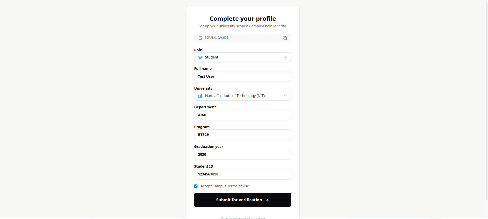
*   **Wallet Dashboard (Balances & Quick Actions):**
    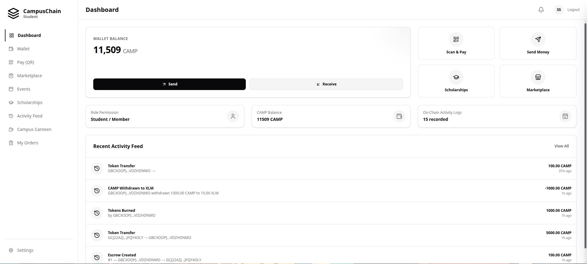
*   **Send & Receive Tokens / Swap Faucet:**
    
*   **Marketplace (P2P Listings & Escrow):**
    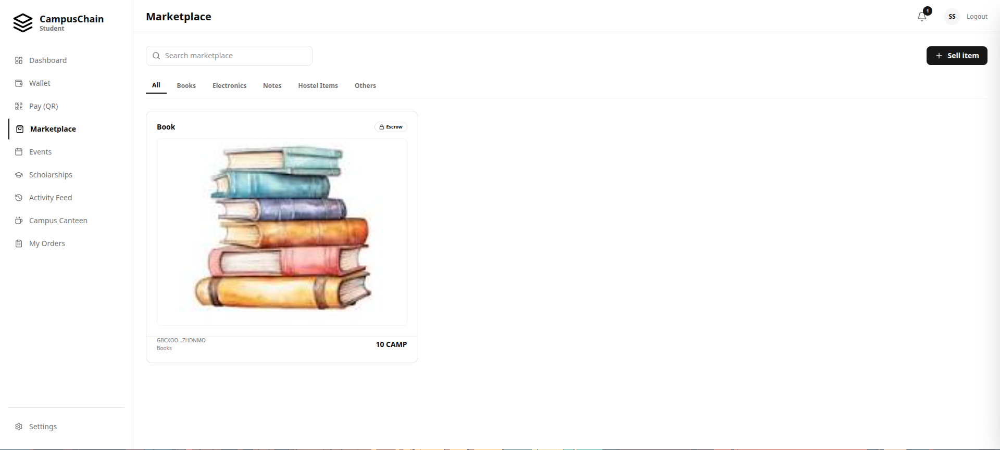
*   **Events Ticketing (Purchase & Creation):**
    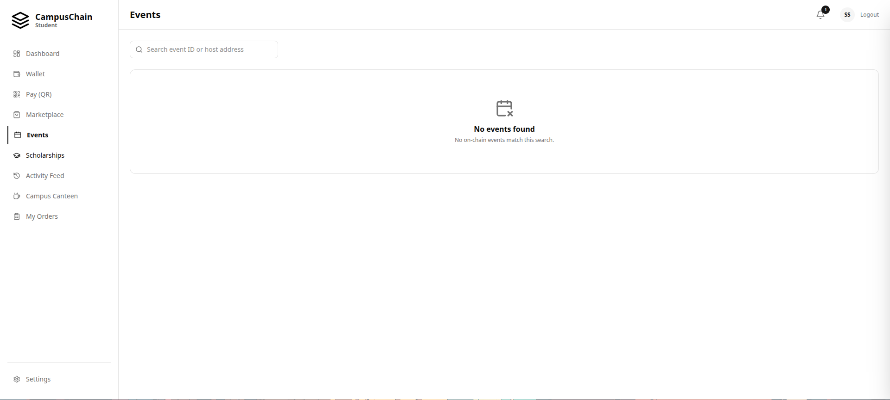
*   **Scholarship Stepper (Submission & Status):**
    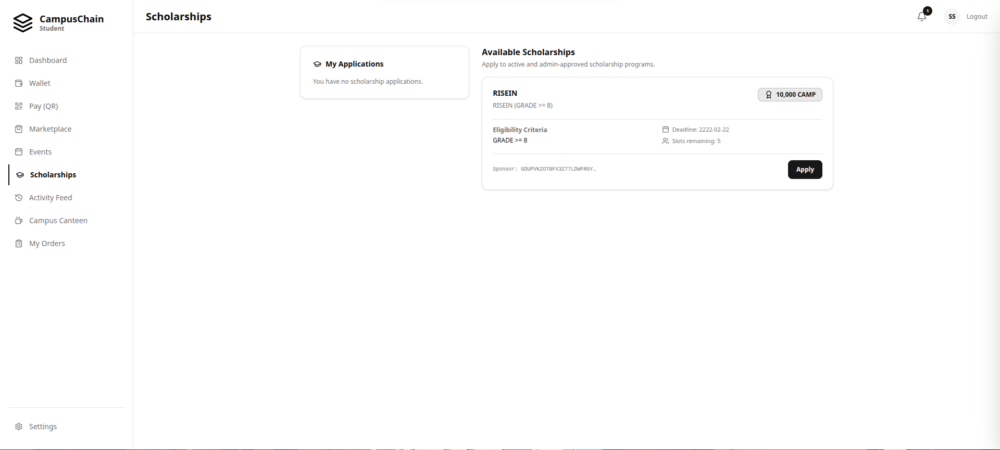
*   **Merchant Canteen Management & Order Tracking:**
    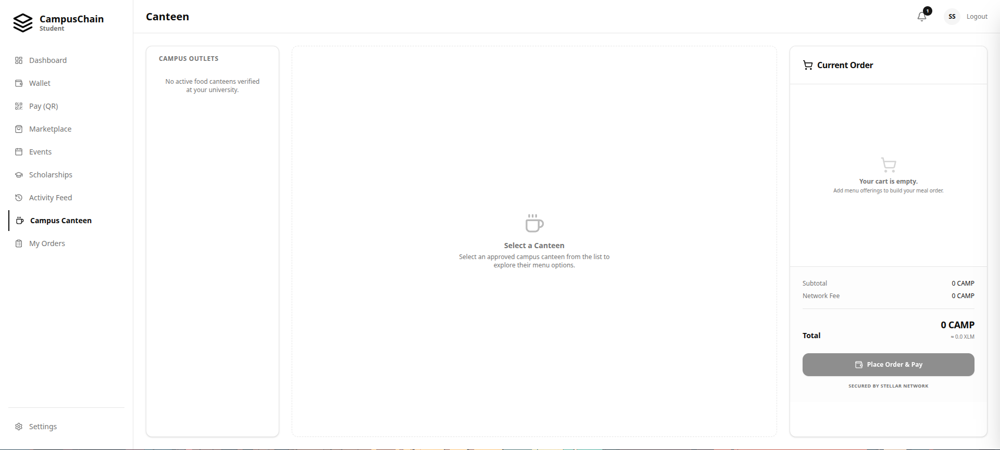
*   **University Admin Dashboard (Profile Verification):**
    
*   **Platform Admin Dashboard (Campus Claims):**
    

### 9.2 Mobile

*   **Responsive Mobile Layout:**
    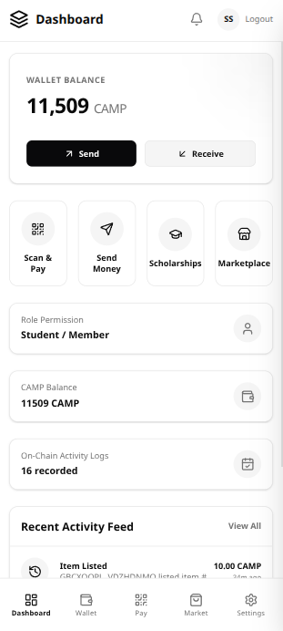
*   **QR Code Payment Scanner (Scan & Pay):**
    
*   **NFT Ticket Redemption (Verification):**
    

### 9.3 Test

*   **Smart Contract Rust Unit/Integration Tests (`cargo test`):**
    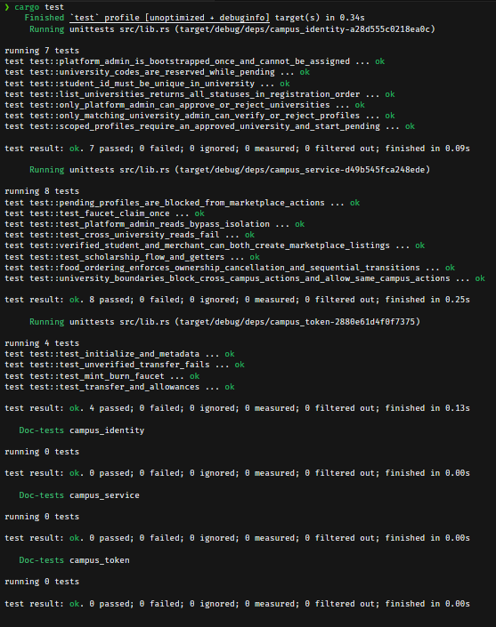
*   **Frontend component & hook unit/integration tests (`npm run test`):**
    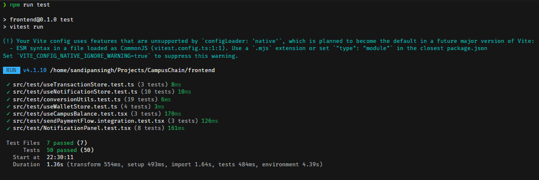

### 9.4 CI/CD

*   **GitHub Actions CI Workflow checks passing on PR/Push:**
    
*   **Vercel build and deployment pipeline status (Production release):**
    

---

## 10. Contract Addresses & On-Chain Verification

### Deployed Contracts (Stellar Testnet)

| Contract | Address | Explorer |
|---|---|---|
| **CampusIdentity** | `CDGOBO2XIZMTEZWSGF5JILPKD7RELJXS5AQSFYANM2QWUJQ7ETJJM3CJ` | [StellarExpert ↗](https://stellar.expert/explorer/testnet/contract/CDGOBO2XIZMTEZWSGF5JILPKD7RELJXS5AQSFYANM2QWUJQ7ETJJM3CJ) |
| **CampusToken** (CAMP) | `CC37FOQRDHKUKERLWJZDHQ2ZYSRGQ3JY42RXRAPUA6G2S4X5774XZQEV` | [StellarExpert ↗](https://stellar.expert/explorer/testnet/contract/CC37FOQRDHKUKERLWJZDHQ2ZYSRGQ3JY42RXRAPUA6G2S4X5774XZQEV) |
| **CampusService** | `CBLZQKQ3OBMNJX57YARH3MDFQLHS2X4VJO2XNJNFC6P2NXYDLLYTSF6Q` | [StellarExpert ↗](https://stellar.expert/explorer/testnet/contract/CBLZQKQ3OBMNJX57YARH3MDFQLHS2X4VJO2XNJNFC6P2NXYDLLYTSF6Q) |
| **Native XLM SAC** | `CDLZFC3SYJYDZT7K67VZ75HPJVIEUVNIXF47ZG2FB2RMQQVU2HHGCYSC` | [StellarExpert ↗](https://stellar.expert/explorer/testnet/contract/CDLZFC3SYJYDZT7K67VZ75HPJVIEUVNIXF47ZG2FB2RMQQVU2HHGCYSC) |

#### CampusIdentity

| Action | Transaction Hash | Explorer |
|---|---|---|
| WASM Upload | `ed1359c549f97a672c52e7bc579dfa7122e1f353e1c41a5e4e71a4d6dcfa5f22` | [View ↗](https://stellar.expert/explorer/testnet/tx/ed1359c549f97a672c52e7bc579dfa7122e1f353e1c41a5e4e71a4d6dcfa5f22) |
| Contract Instantiate | `b280460c61117776f7f81869ddc8810b64141aaeaf172c554d77d575b52c0790` | [View ↗](https://stellar.expert/explorer/testnet/tx/b280460c61117776f7f81869ddc8810b64141aaeaf172c554d77d575b52c0790) |
| `initialize()` | `8c2cacca2fbfa456bff8c726d22b9d465fd41238e695d570c1b888a247910de9` | [View ↗](https://stellar.expert/explorer/testnet/tx/8c2cacca2fbfa456bff8c726d22b9d465fd41238e695d570c1b888a247910de9) |

#### CampusToken

| Action | Transaction Hash | Explorer |
|---|---|---|
| WASM Upload | `8dbff51ae775973ab146b692a464007f02270d2e245a143a4e2221455265f92b` | [View ↗](https://stellar.expert/explorer/testnet/tx/8dbff51ae775973ab146b692a464007f02270d2e245a143a4e2221455265f92b) |
| Contract Instantiate | `9ba86932646865334c612dcb37c8f1804b3354a331f15b273d9cdde36b8f5eb8` | [View ↗](https://stellar.expert/explorer/testnet/tx/9ba86932646865334c612dcb37c8f1804b3354a331f15b273d9cdde36b8f5eb8) |
| `initialize()` | `8bc4e0d5139050bec8c063e91f7347dd97c7e567fc22dcfdf36b97080f75a42d` | [View ↗](https://stellar.expert/explorer/testnet/tx/8bc4e0d5139050bec8c063e91f7347dd97c7e567fc22dcfdf36b97080f75a42d) |

#### CampusService

| Action | Transaction Hash | Explorer |
|---|---|---|
| WASM Upload | `a9671a8e4a281fbff345ab6bc8b1cc1e35cf7e9bd3d69aa556c38fc95731b74c` | [View ↗](https://stellar.expert/explorer/testnet/tx/a9671a8e4a281fbff345ab6bc8b1cc1e35cf7e9bd3d69aa556c38fc95731b74c) |
| Contract Instantiate | `0ce93e2d1507814f0c5553c39bdcc1f5ba0d50f3be6cf8fb698e85b2a781fa90` | [View ↗](https://stellar.expert/explorer/testnet/tx/0ce93e2d1507814f0c5553c39bdcc1f5ba0d50f3be6cf8fb698e85b2a781fa90) |
| `initialize()` | `96f09b30998d4cfa6c36a6e5acd33150956c7100a72f7fda5cd7bd54cf0b2a8a` | [View ↗](https://stellar.expert/explorer/testnet/tx/96f09b30998d4cfa6c36a6e5acd33150956c7100a72f7fda5cd7bd54cf0b2a8a) |

### WASM Hashes

| Contract | WASM Hash |
|---|---|
| CampusIdentity | `06a3b6bedfdc4983af2f38011b96f08616e27536f769f306a531415404976119` |
| CampusToken | `82654bcdfe15c8477fd48c3c9dd2b9a46c6f3fd36026fbeeebc5c073155c2da5` |
| CampusService | `ad651b95b8e16b63cb5e3f25895cfa7730b264d5ab0d73b718933847870cf69c` |

---

## 11. Resources & Links

| Resource | Link |
|---|---|
| 🌐 Live demo (Stellar Mainnet/Testnet interface) | [campuschain.sandipansingh.com ↗](https://campuschain.sandipansingh.com) |
| 🎥 Demo video | `<!-- embed a Loom / YouTube link here -->` |
| 🧪 Testnet faucet | [Stellar Laboratory Friendbot](https://laboratory.stellar.org/#account-creator?network=testnet) |
| 📖 Stellar docs | [developers.stellar.org](https://developers.stellar.org) |
| 🔍 Contract explorer | [StellarExpert Testnet](https://stellar.expert/explorer/testnet) |

---

## 12. Feedback & Responses

We appreciate your feedback and suggestions! Please use the following links to interact with our feedback portal:

*   📝 **Submit Feedback (Google Form):** [Feedback Form ↗](https://forms.gle/u2BEwqcTnCpGBBUg8)
*   📊 **View Responses (Google Sheet):** [Feedback Responses Sheet ↗](https://docs.google.com/spreadsheets/d/1HNzt2QfXsF_n4LzUpJnpaSk4cKBfVsngAfEyxHbXqkU/edit?usp=sharing)

---

## Contributing

1. Fork the repo and create a feature branch.
2. Follow the [Conventional Commits](https://www.conventionalcommits.org/) specification for all commit messages.
3. Run `cargo fmt`, `cargo clippy`, and `npm run lint` before pushing.
4. Open a PR — the `pr-checks` workflow must pass before review.

## License

[MIT © Sandipan Singh](LICENSE)
