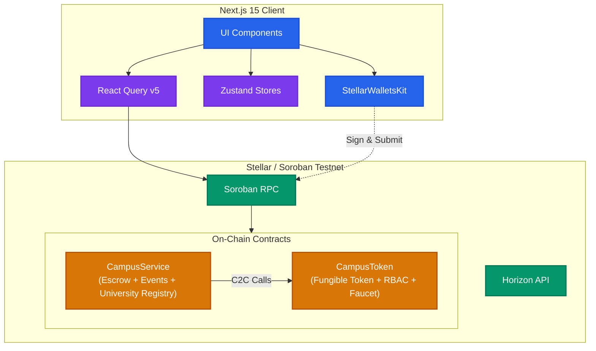
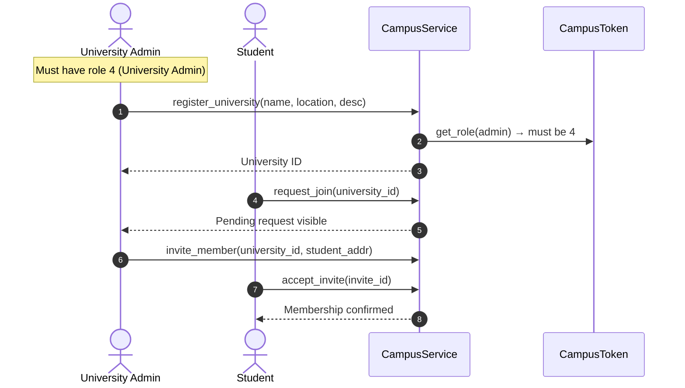
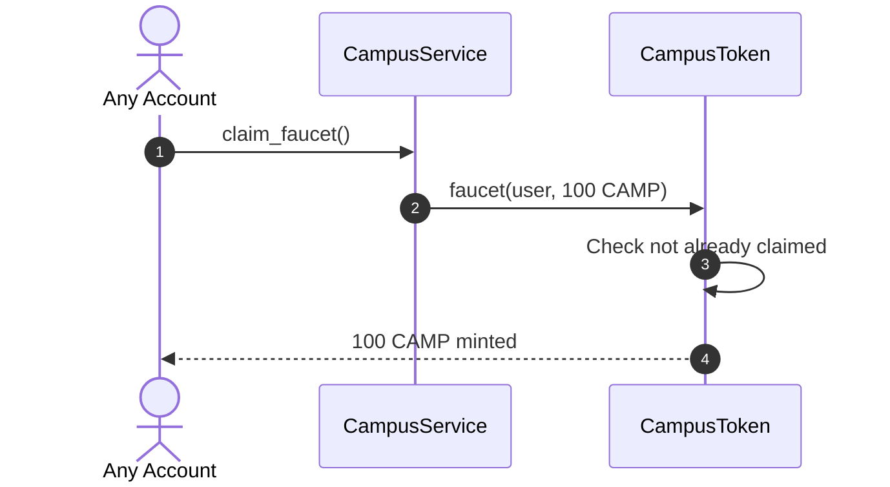
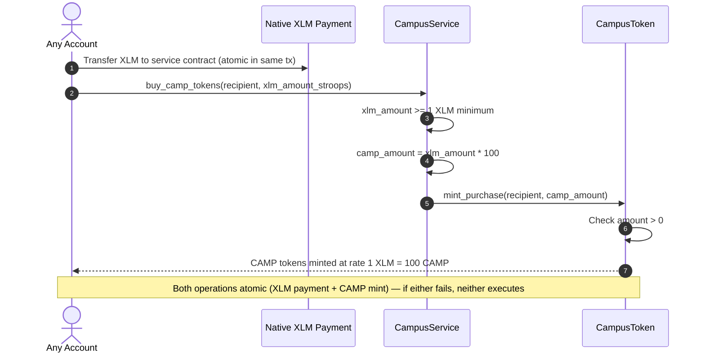

# <p align="center">CAMPUSCHAIN – UNIFIED CAMPUS ECONOMY</p>

CampusChain is a unified, decentralized campus economy platform that replaces disconnected cash and manual-verification payment portals with a single secure, Stellar-powered payment, escrow, ticketing, and university registry portal.

---

## 🚀 Live Deployments (Soroban Testnet)

| Contract | Address |
|---|---|
| **CampusToken** | `CDGMOVTFKTMHVDZSQRSH3O4Y3FXFLORCJW3JM2YXNXQTLCBMZVKXQXJP` |
| **CampusService** | `CDTJ56RPMPE2VNYLCV7CFPS3IHUVR4UZIRC4JJ2RWCE5WDHB6BVAYSSM` |

### Recent Transactions

| Action | Tx Hash |
|---|---|
| CampusToken upload | [10b3920f7f404c540bce1fa5297016fb4e76056afb599af00e5bec323ebaaf41](https://stellar.expert/explorer/testnet/tx/10b3920f7f404c540bce1fa5297016fb4e76056afb599af00e5bec323ebaaf41) |
| CampusToken deploy | [16945cc3fdc5dfe1c0a4e481b07b792d662e24186cf2d19221692919c9ec7b9f](https://stellar.expert/explorer/testnet/tx/16945cc3fdc5dfe1c0a4e481b07b792d662e24186cf2d19221692919c9ec7b9f) |
| CampusToken init | [6cb8941b97330ea87be549a3d485a133b0e613eb8bd06ec5ce44dcdf3cc1fa5f](https://stellar.expert/explorer/testnet/tx/6cb8941b97330ea87be549a3d485a133b0e613eb8bd06ec5ce44dcdf3cc1fa5f) |
| CampusService upload | [f2f166634dcb3260eb80645e257662a3a840518199e3c6a8cd301700b814eed7](https://stellar.expert/explorer/testnet/tx/f2f166634dcb3260eb80645e257662a3a840518199e3c6a8cd301700b814eed7) |
| CampusService deploy | [910045a92044d2b15b159202b85ed79c9e8c4a0aa5faf94e68d61184bd97a723](https://stellar.expert/explorer/testnet/tx/910045a92044d2b15b159202b85ed79c9e8c4a0aa5faf94e68d61184bd97a723) |
| CampusService init | [9eaa7ea3110a210193051547090e6e04407960de140b8139bdcdf6cfa2dc7762](https://stellar.expert/explorer/testnet/tx/9eaa7ea3110a210193051547090e6e04407960de140b8139bdcdf6cfa2dc7762) |

---

## 1. System Architecture

### Component Architecture

```mermaid
graph TD
    classDef frontend fill:#2563EB,stroke:#1D4ED8,stroke-width:2px,color:#FFFFFF;
    classDef contract fill:#D97706,stroke:#B45309,stroke-width:2px,color:#FFFFFF;
    classDef stellar fill:#059669,stroke:#047857,stroke-width:2px,color:#FFFFFF;
    classDef state fill:#7C3AED,stroke:#6D28D9,stroke-width:2px,color:#FFFFFF;

    subgraph Client ["Next.js 15 Client"]
        UI["UI Components"]
        SWK["StellarWalletsKit"]
        Zustand["Zustand Stores"]
        ReactQuery["React Query v5"]
    end

    subgraph StellarNetwork ["Stellar / Soroban Testnet"]
        RPC["Soroban RPC"]
        Horizon["Horizon API"]
        subgraph SorobanContracts ["On-Chain Contracts"]
            Token["CampusToken<br/>(Fungible Token + RBAC + Faucet)"]
            Service["CampusService<br/>(Escrow + Events + University Registry)"]
        end
    end

    UI --> SWK
    UI --> Zustand
    UI --> ReactQuery
    ReactQuery --> RPC
    SWK -.-> |Sign & Submit| RPC
    RPC --> SorobanContracts
    Service --> |C2C Calls| Token

    class UI,SWK frontend;
    class Zustand,ReactQuery state;
    class RPC,Horizon stellar;
    class Token,Service contract;
```

### Key Flows

**University Registration & Membership**

```mermaid
sequenceDiagram
    autonumber
    actor Admin as University Admin
    actor Student as Student
    participant SC as CampusService
    participant TC as CampusToken

    Note over Admin: Must have role 4 (University Admin)
    Admin->>SC: register_university(name, location, desc)
    SC->>TC: get_role(admin) → must be 4
    SC-->>Admin: University ID

    Student->>SC: request_join(university_id)
    SC-->>Admin: Pending request visible

    Admin->>SC: invite_member(university_id, student_addr)
    Student->>SC: accept_invite(invite_id)
    SC-->>Student: Membership confirmed
```

**Token Faucet**

```mermaid
sequenceDiagram
    autonumber
    actor User as Any Account
    participant SC as CampusService
    participant TC as CampusToken

    User->>SC: claim_faucet()
    SC->>TC: faucet(user, 100 CAMP)
    TC->>TC: Check not already claimed
    TC-->>User: 100 CAMP minted
```

**Buy CAMP with XLM**

```mermaid
sequenceDiagram
    autonumber
    actor User as Any Account
    participant PN as Native XLM Payment
    participant SC as CampusService
    participant TC as CampusToken

    User->>PN: Transfer XLM to service contract (atomic in same tx)
    User->>SC: buy_camp_tokens(recipient, xlm_amount_stroops)
    SC->>SC: xlm_amount >= 1 XLM minimum
    SC->>SC: camp_amount = xlm_amount * 100
    SC->>TC: mint_purchase(recipient, camp_amount)
    TC->>TC: Check amount > 0
    TC-->>User: CAMP tokens minted at rate 1 XLM = 100 CAMP
    Note over User,TC: Both operations atomic (XLM payment + CAMP mint) — if either fails, neither executes
```

---

## 2. Smart Contracts

### CampusToken (`contracts/campus-token`)
- **Fungible token** (7 decimals, symbol: CAMP)
- **RBAC**: `set_role(admin, address, role)` — role 0-1 self-assignable, role 2+ requires contract admin approval
- **Role Request Flow**: `request_role_change(applicant, role)`, `approve_role_change(request_id, admin)`, `deny_role_change(request_id, admin)` — Merchant (2) and Club Organizer (3) require admin approval
- **Faucet**: `faucet(address, amount)` — one-time claim of 100 CAMP per address
- **Purchase Mint**: `mint_purchase(address, amount)` — called by CampusService to mint CAMP when users buy with XLM
- **Standard token ops**: `transfer`, `approve`, `transfer_from`, `mint`, `burn`, `balance`

### CampusService (`contracts/campus-service`)
- **University Registry**: `register_university`, `list_universities`, `get_university`
- **Membership**: `request_join`, `approve_member`, `deny_member`, `invite_member`, `accept_invite`, `leave_university`, `get_membership`, `list_pending_requests`
- **Escrow**: `create_escrow`, `get_escrow`, `release_escrow`, `refund_escrow`
- **Event Ticketing**: `create_event`, `get_event`, `buy_ticket`, `get_ticket`, `redeem_ticket`
- **Token Claim**: `claim_faucet`, `has_claimed_faucet`
- **Buy CAMP**: `buy_camp_tokens(recipient, xlm_amount)` — purchase rate 1 XLM = 100 CAMP (minimum 1 XLM), XLM transferred atomically via native payment op in same tx
- **Frontend fix**: All contract call parameters now use correct `u64` ScVal type (previously incorrectly sent as `u32`, causing join/invite failures)

---

## 3. Tech Stack

[](https://skillicons.dev)


- **Smart Contracts**: Rust & Soroban SDK v21
- **Frontend**: Next.js 15 (App Router), TypeScript, Tailwind CSS v4, Zustand, TanStack React Query v5
- **Wallet**: StellarWalletsKit (Freighter)
- **Testing**: `cargo test` (11 contract tests: 7 token + 4 service), Vitest (frontend)
- **CI/CD**: GitHub Actions

---

## 4. Quick Start

### Smart Contracts
```bash
cargo build --target wasm32-unknown-unknown --release
cargo test
```

### Frontend
```bash
cd frontend
npm install
npm run dev
```

### Deploy (Testnet)
```bash
CAMPUSCHAIN_ADMIN_KEY=<secret_key> ./scripts/deploy.sh
```

### Frontend Env
Copy `frontend/.env.local` with:
```
NEXT_PUBLIC_STELLAR_RPC_URL="https://soroban-testnet.stellar.org"
NEXT_PUBLIC_STELLAR_PASSPHRASE="Test SDF Network ; September 2015"
NEXT_PUBLIC_CAMPUS_TOKEN_CONTRACT_ID="CDGMOVTFKTMHVDZSQRSH3O4Y3FXFLORCJW3JM2YXNXQTLCBMZVKXQXJP"
NEXT_PUBLIC_CAMPUS_SERVICE_CONTRACT_ID="CDTJ56RPMPE2VNYLCV7CFPS3IHUVR4UZIRC4JJ2RWCE5WDHB6BVAYSSM"
NEXT_PUBLIC_CAMPUS_ADMIN_ADDRESS="GBPVICMAESR2O4LJRDAV2YGGIQDAEY6ANCAF3GLIXEYRAIDDXM7WQP7X"
```

---

## 5. Documentation Index

- [System Architecture & Diagrams](./docs/architecture.md)
- [Smart Contract Specifications](./docs/CONTRACTS.md)
- [Security Practices & Threat Modeling](./docs/SECURITY.md)
- [Deployment & Upgrade Guide](./docs/DEPLOYMENT.md)
- [Frontend API & Hooks Schema](./docs/API.md)
