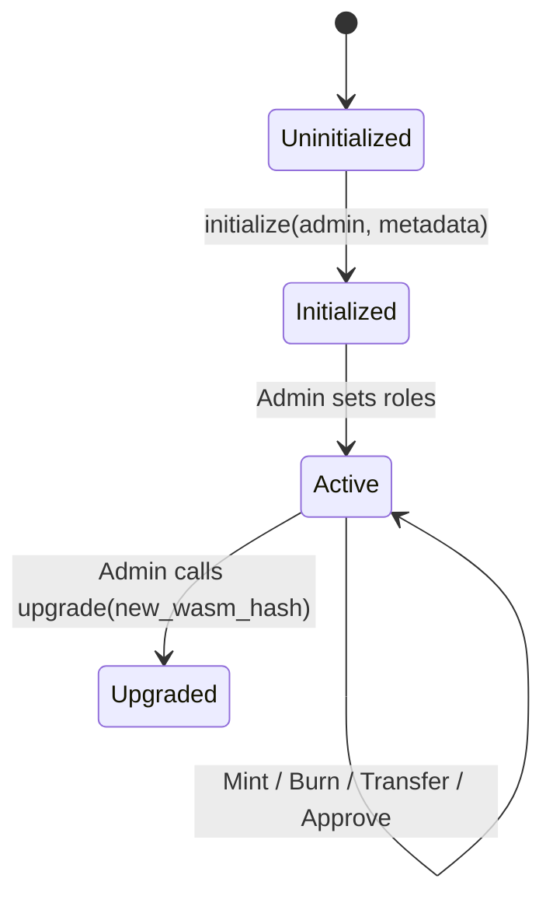

# CampusChain Smart Contract Specifications

This document outlines the architecture, storage layouts, access control/RBAC design, state transitions, and upgrade strategies for the CampusChain Soroban smart contracts.

---

## 1. CampusToken Contract

The `CampusToken` contract is a custom asset token implementing the standard Soroban Token Interface (similar to SEP-41) but with additional on-chain Role-Based Access Control (RBAC) and explicit administrative features.

### Storage Layout

The contract utilizes a hybrid storage model to optimize fees and prevent unbounded state growth.

| Key | Storage Type | Data Type | Description |
|---|---|---|---|
| `DataKey::Admin` | Instance | `Address` | The administrator address of the university. |
| `DataKey::TotalSupply` | Instance | `i128` | The total number of tokens in circulation. |
| `DataKey::Metadata` | Instance | `TokenMetadata` | Struct containing name, symbol, and decimals. |
| `DataKey::Balance(Address)` | Persistent | `i128` | Balance of a specific address. |
| `DataKey::Allowance(Address, Address)` | Persistent | `AllowanceData` | Spending allowance granted to a spender by a grantor. |
| `DataKey::Role(Address)` | Persistent | `u32` | RBAC role designation for the address. |

### Access Control & RBAC

We define four roles using integer identifiers:
- `0` - **Guest / None**: Default unassigned role.
- `1` - **Student**: Allowed to send/receive tokens and buy tickets.
- `2` - **Merchant**: Allowed to accept marketplace escrows and redeem tokens.
- `3` - **Club Organizer**: Allowed to create events, sell tickets, and receive rewards.
- `4` - **University Admin**: Ultimate contract owner. Allowed to mint/burn tokens, assign roles, and upgrade the contract.

#### Security Checks
- Admin functions require `admin.require_auth()`.
- Standard transfers require the sender's signature: `from.require_auth()`.

### State Transitions



---

## 2. CampusService Contract

The `CampusService` contract handles marketplace escrow agreements and event ticketing services, performing contract-to-contract (C2C) calls to the `CampusToken` contract.

### Storage Layout

| Key | Storage Type | Data Type | Description |
|---|---|---|---|
| `DataKey::Admin` | Instance | `Address` | The administrator address of the services. |
| `DataKey::TokenContract` | Instance | `Address` | Address of the `CampusToken` contract. |
| `DataKey::Escrow(u64)` | Persistent | `EscrowAgreement` | Details of a marketplace transaction by ID. |
| `DataKey::EscrowCounter` | Instance | `u64` | Counter used to generate unique Escrow IDs. |
| `DataKey::Event(u64)` | Persistent | `EventDetails` | Event configuration (price, capacity, host) by ID. |
| `DataKey::EventCounter` | Instance | `u64` | Counter used to generate unique Event IDs. |
| `DataKey::Ticket(u64)` | Persistent | `TicketDetails` | Ticket ownership and validation state by ID. |
| `DataKey::TicketCounter` | Instance | `u64` | Counter used to generate unique Ticket IDs. |

### Data Structures

```rust
#[contracttype]
pub struct EscrowAgreement {
    pub id: u64,
    pub buyer: Address,
    pub seller: Address,
    pub amount: i128,
    pub status: u32, // 0: Created, 1: Funded, 2: Completed, 3: Refunded
}

#[contracttype]
pub struct EventDetails {
    pub id: u64,
    pub host: Address,
    pub price: i128,
    pub capacity: u32,
    pub tickets_sold: u32,
}

#[contracttype]
pub struct TicketDetails {
    pub id: u64,
    pub event_id: u64,
    pub owner: Address,
    pub redeemed: bool,
}
```

### Access Control
- Escrow release requires either the `buyer`'s signature or the `admin`'s signature.
- Escrow refund requires either the `seller`'s signature or the `admin`'s signature.
- Ticket redemption requires the event `host`'s signature.

---

## 3. Smart Contract Upgrade Strategy

Both contracts implement the Soroban upgrade pattern. The admin can replace the running Wasm byte-code of the contract without changing the contract ID or losing state.

### Implementation Pattern

1. **Upload Wasm**: The admin uploads the new Wasm code to the ledger, obtaining a 32-byte Wasm Hash.
2. **Execute Upgrade**: The admin calls the `upgrade` method on the target contract:
   ```rust
   pub fn upgrade(env: Env, new_wasm_hash: BytesN<32>) {
       let admin: Address = env.storage().instance().get(&DataKey::Admin).unwrap();
       admin.require_auth();
       env.deployer().update_current_contract_wasm(new_wasm_hash);
   }
   ```
3. **Migration (if needed)**: If the storage format has changed, the upgrade method can be modified to write migration logic to convert old storage formats to the new format before switching the Wasm hash.
