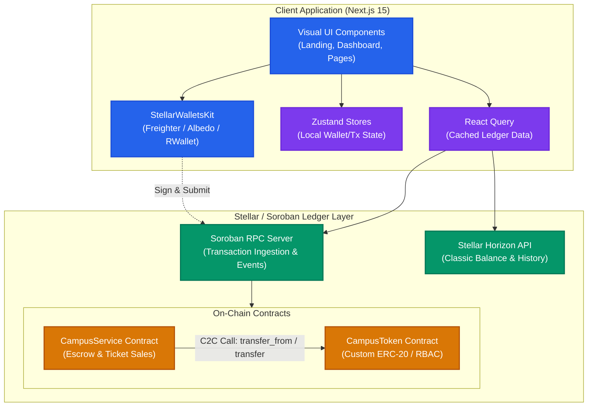
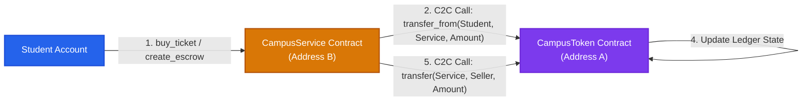
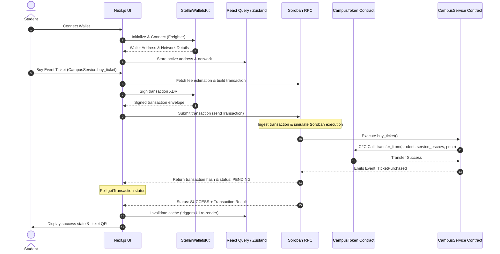

# CampusChain Architecture & System Design

This document details the system design, components, inter-contract relationships, transaction lifecycles, and data flows for the CampusChain platform.

---

## 1. System Architecture

The following diagram illustrates the interaction between the student/merchant frontend, the local/global state layers, the Stellar network nodes (RPC and Horizon), and the Soroban smart contracts.

---

## 2. Inter-Contract Communication Flow

This diagram outlines how the `CampusService` contract interacts with the `CampusToken` contract. The service contract acts as an escrow agent or ticket reseller, performing contract-to-contract (C2C) calls.

---

## 3. Transaction Lifecycle State Diagram

Soroban transactions follow a structured, asynchronous path from creation to confirmation. The client application tracks these states in real time.

```mermaid
stateDiagram-v2
    [*] --> Idle : User initiates action
    Idle --> PendingSignature : Build transaction & request wallet signature
    PendingSignature --> Submitting : Wallet signs & transaction submitted to RPC
    Submitting --> Processing : Transaction accepted; waiting for ledger ingestion
    Processing --> Confirmed : RPC returns SUCCESS (Status: CONFIRMED)
    Processing --> Failed : RPC returns ERROR (Status: FAILED / TIMEOUT)
    Failed --> Retrying : User triggers retry / adjust fee
    Retrying --> PendingSignature
    Confirmed --> [*]
```

---

## 4. Data Flow Sequence Diagram

This sequence diagram depicts the end-to-end flow from user authorization to transaction execution, settlement, and metadata archival.

